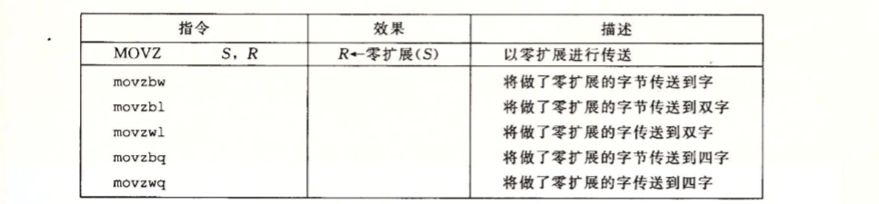
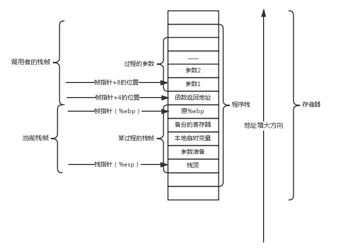
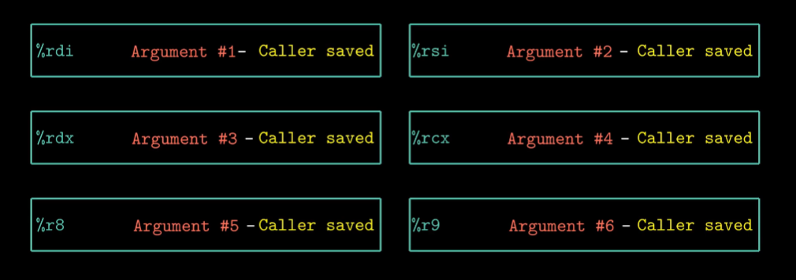

# CSAPP深入理解计算机系统学习笔记

---

## 1 信息的表示和处理

### 1.1 信息存储

#### 1.1.1 数据存储规范

**信息**在计算机中，以01串来存储。
为方便查看，人类在读取时常常采用16进制来书写数据，简洁而明晰。

##### 1.1.1.1 单位

**比特（bit）**：bit，表示一个01位，常用于描述网络数据传输量和速率。
**字节（Byte）**：Byte,表示8个bit，用于计算机内部数据大小的描述。
**字（word）**：word，依据表示16、32、64个Byte，用于描述计算机一次读取与处理数据的量。

#### 1.1.2 排列

数据存储时，以一个字节，两个16进制数的形式存储。
**单字节数据**:不考虑排列顺序。
**多字节数据**：分为大端法，小端法。

+ 大端法：数据高位排列在前。
+ 小端法：数据低位排列在前。

PS: 仅限数据段及代码段中的数据，指令本身不受影响

#### 1.1.3 信息的解释

在计算机中，所有类型的变量都表示为01串，在解释与使用时，则需要按照一定的规则对01串进行解读

**数字**：按照无符号、有符号、浮点数规则进行解读，具体如后文所述。
**字符串**：按照ansi、Unicode（UTF-8等）进行编码，对应字符集中的文字。
**代码**：在经编译器加工后，产生对应指令，对应CPU架构指令集中的某些操作。

##### 1.1.3.1 字符串编码详解

#### 1.1.4 01串运算

对于01串，计算机一般含有以下运算：

**位级运算**：针对每一bit的布尔代数中的与、或、非、异或等。
**逻辑运算**：针对整个变量01串的布尔代数。
**移位运算**：分为左移、逻辑右移与算数右移，对应不同数字需要的情况。

## 1.2 信息处理详解

### 1.2 整数详解

概述：计算机中整数分为两种，无符号数，有符号数（补码），之后的讨论将同时考虑到两者。

#### 1.2.1 整数的表示

##### 1.2.1.1 整数的编码

**无符号数**：无符号数采用从高到低加权相加组织数字。权值为2^k-1^
**有符号数**：采用补码，使用第一位为符号位，组织数字时，其权值为-

##### 1.2.1.2 整数的长短转换

**无符号数**：

+ 长变短：直接截断高位，再进行计算
+ 短变长：高位补0

**有符号数**：

+ 长变短：先作为无符号数解释，截断后再作为有符号数解释。
+ 短变长：高位补符号位

##### 1.2.1.3 无符号数与有符号数的转换

+ **无符号转有符号**：范围内不变；范围外映射到负数
+ **有符号转无符号**：非负数不变，负数映射到大数:x^=x+x~w-1~ 2^w^

要义：01串不变，改变解释方式

#### 1.2.2 整数的计算

##### 1.2.2.1 位运算

+ **无符号数**：
  + 左移：去掉高位，低位补0
  + 右移：去掉低位，高位补0
+ **有符号数**：
  + 左移：去掉高位，低位补0
  + 逻辑右移：去掉低位，高位补0
  + 计算右移：去掉低位，高位补最高位数字

##### 1.2.2.2 加法

+ **无符号**：范围内正常；范围外映射回来：x+y-2^w^
+ **有符号**：范围内正常；
  + 正数范围外映射为负数：x+y-2^w^
  + 负数范围外映射为正数：x+y+2^w^

##### 1.2.2.3 乘法

+ **无符号**：(x$\times$y)mod2^w^
+ **有符号**：作为无符号处理，再作有符号解释
+ PS：有符号数与无符号数乘法的位级等价性

##### 1.2.2.3 乘以常数的简便计算

有时，计算机会将常数乘法化简为移位运算与加法运算；除法运算同理。

### 1.3 浮点数详解

概述：为解决科学与工程问题，需要小数。在有限位的计算机程序中，采用定点小数的方法来表示小数，存在较大误差与局限，故引入**IEEE浮点表示规则**。

#### 1.3.1 IEEE浮点表示

在**IEEE浮点表示**中，01串被分为三个部分：

+ **符号（s）**：用以表示数的正负
+ **尾数（M）**：用以表示数字
+ **阶码（E）**：用以表示数字对应的大小

其计算结果为(-1)^s^$\times$M$\times$2^E^。

在float中，s、M、E分别占1、8、23bit。
在double中，s、M、E分别占1、11、52bit。

#### 1.3.2 移码（偏码）

在三部分中，阶码（E）部分的数字并不直接代表E，而是：E=e-Bias（偏移）

##### 1.3.2.1 缘由

浮点数加减计算中，需先进行对阶，这就需要对浮点数的大小进行判断，这个过程一般采用阶码。而阶码部分的编码，采用有符号（小数需要）编码，故对其进行对比较为复杂。

##### 1.3.2.2 规则

为解决上述问题，采用以下原则：

1. 阶码采用无符号编码（8位：e范围0-255,其中0与255保留）
2. Bias=2^7^-1=127
3. 解读时，计算E。E=e-Bias（8位范围-126~127）（非规格化时E=1-Bias）

#### 1.3.3 浮点表示数字种类

浮点数表示的数字分为三类：规格化数值、非规格化的值、特殊值。

##### 1.3.3.1 规格化数值

+ 形式: s e!=0&&e!=255 f
+ 作用：表示常规数值
+ PS：M隐含以1开始，即表示为1.fffff

##### 1.3.3.2 非规格化数值

+ 形式：s e=0 f
+ 作用：表示0与均匀地表示接近0的数字（逐渐下溢）
+ PS：有利于浮点数可以按照其01表示的整数进行排列

##### 1.3.3.3 特殊值

特殊值有两类：

+ 无穷大 s e=11111111 f=0
+ NaN    s e=11111111 f!=0

#### 1.3.4 舍入

舍入分为许多种类：

+ 向上舍入
+ 向下舍入
+ 向零舍入
+ 向偶数舍入（二进制意义）

浮点数计算采用**向偶舍入**，有利于防止舍入造成的数字偏大、偏小。

#### 1.3.5 浮点数计算

浮点运算支持：

+ 交换律
+ 单调性

但是缺乏支持：

+ 结合律
+ 分配律

特殊规则：

+ NaN$\times$x=NaN
+ /0=无穷

---

## 2 程序的机器级表示

### 2.1 概述

计算机执行的是**机器码**，即一种字节序列，这是人类所难以理解的。高级编程语言封装了有关的细节实现，是我们能够在不了解机器实现的基础上进行编程工作。本章将介绍源代码经预处理与编译后产生的**汇编码**。

**汇编码**：汇编码是一种经过简单解释的机器码，一条汇编指令对应一条机器指令，虽然仍旧基于机器的指令集来进行编程工作，但经过简单的解释，变得有理可循，交易理解。

**指令集**：计算机的运行基于**中央处理单元**，不同的中央处理单元可以实现的机器级指令不尽相同，而指令的集合也就称为**指令集**。从汇编码对应机器指令可以得到，不同CPU拥有不同的汇编语言。

**CPU架构发展史**：

1. 英特尔开发出16位、32位CPU架构，Intel Architecture32(IA32)。
2. AMD开发出64位CPU架构，称为AMD64，亦称Intel 64。即今日x86-64系列，向下兼容16、32位软件。
3. 英特尔追加开发IA64，安腾系列，不向下兼容，仅用于服务器。

PS：之后的叙述基于x86-64展开

### 2.2 CPU的组成

前文提及，汇编语言是一门与机器级代码一一对应的语言，为了了解、学习这样一门语言，自然少不了对硬件的了解，其中，又以执行命令的CPU为重，故而对CPU的认识乃是学习汇编中必不可少的一步。

以8086CPU为例，可以看到，现代CPU不仅承担CPU的功能，还集成了北桥计算机的北桥系统（北桥负责CPu与PCI-e、内存连接）。故CPU（x64）可以分成两个部分：

+ **Execution Unit(EU,执行单元)**：负责指令的执行
  1. 16个通用寄存器
  2. 标志寄存器
  3. 算数逻辑单元（ALU）
  4. EU控制器

+ **Bus Interface Unit（BIU，总线接口单元）**：负责CPU与外界数据的交换
  1. 6个段寄存器
  2. 程序计数器（PC，也称IP）
  3. 指令缓冲器
  4. 地址加法器（$\Sigma$）

我们将逐个认识其组成

#### 2.2.1 寄存器

CPU运行过程中难免对数据的临时存储有一定的需求，这便是寄存器的功用了。X86架构的CPU采用复杂指令集（CISC）路线，故为其提供了大量寄存器来实现其指令。

##### 2.2.1.1 通用寄存器

x64架构下的通用寄存器由8086扩展而来，有原有的8个寄存器的64位扩展，及新加入的8个64位寄存器，共计16个64位寄存器。

64位寄存器可存储大小为8、16、32、64bit的数据，在调用时分别采用其对应的名称来使用。

作为通用寄存器，并没有存储CPU必要信息的用途，可以供应用程序自由使用。但是，每个寄存器都有自己独特（习惯性使用）的用途：

1. %rax：保存函数返回值/执行加法
2. %rbx：函数被调用者保存/数据存取
3. %rcx：函数调用第四参数/计数器
4. %rdx：函数调用第3参数/读写IO端口号
5. %rsi：函数调用第2参数/字符串源地址
6. %rdi：函数调用第1参数/字符串目的地址
7. %rbx：函数被调用者保存/栈底指针
8. %rsp：栈顶指针
9. %r8：函数调用第5参数
10. %r9：函数调用第6参数
11. %r10：函数调用者保存
12. %r11：函数调用者保存
13. %r12：函数被调用者保存
14. %r13：函数被调用者保存
15. %r14：函数被调用者保存
16. %r15：函数被调用者保存

##### 2.2.1.2 标志寄存器（条件码寄存器）

除了存储数据外，CPU运行线程时还需要记录一些线程的状态信息，如计算溢出、进位等等，故CPU中采用了标志寄存器来存储这些信息。其中的信息由CPU自动设置和使用。

图中是32位下的标志寄存器，但实际上，并没有完全使用；而在64位扩展后，虽然标志寄存器也成了64位，但是多出来的32位同样没有被使用。

简单介绍各个位的功能：

1. CF：进位标志（运算结果最高位进位借位）
2. PF：奇偶标志（最低字节1个数为偶数为1）
3. AF：辅助进位标志（低字节向高字节/第四位向高四位发生进位借位时1）
4. ZF：0标志位（运算结果为0时为1）
5. SF：符号标志（与运算结果最高位相同）
6. OF：溢出标志（发生溢出为1）
7. DF：方向标志（1减0增）
8. TF：跟踪标志
9. IF：中断标志
10. $\dots$

条件码寄存器中的标志位保存了最近所进行操作的属性，用于条件跳转、条件传输等功能。

##### 2.2.1.3 指令寄存器（PC/IP）

PC中保存着CPU需要执行的下一条指令在内存中的位置。

##### 2.2.1.4 段寄存器

CPU在执行指令过程中，所需要的数据不仅仅从寄存器中获取，更需要与内存进行数据交换。

段寄存器记录了内存段的基地址，用于配合CPU完成内存寻址。
内存寻址相关内容将在后续章节中详细叙述。

##### 2.2.1.5 控制寄存器

与标志寄存器类似，控制寄存器记录了运行状态信息，但是又不同，

##### 2.2.1.6 向量寄存器

向量寄存器用于存储一或多个整数或浮点数

#### 2.2.2 算数逻辑单元（ALU）

ALU内集成了算数单元与逻辑单元。

+ 算数单元：一般支持加法、带进位的加法、减法、带借位的减法、增量（+1）、减量（-1）数字无改变通过
+ 逻辑单元：执行逻辑操作，比如之前讨论过的AND，OR和NOT操作，它也能做简单的数值测试，比如一个数字是不是负数。

ALU接收操作码、以及两个操作数，进行计算后，给出计算结果，存入寄存器；以及输出相应的标志计算结果，改变标志位。

<!-- 日后补全 -->

### 2.3 机器级代码

#### 2.3.1 机器级抽象

了解CPU的基本构造后，便可开始进行汇编指令的学习了，但是CPU的工作流程十分复杂，汇编指令对应的是CPU一系列活动的总和，故，需要抽象地封装CPU的活动，称为机器级抽象。

机器级抽象分为两大块：

1. 指令集架构（ISA）：定义了处理器的行为状态，而将处理器的实现封装起来，保证符合同意指令集的CPU在同一指令下，表现出来的行为相同。
2. 虚拟内存：向汇编提供一个类似大型数组的内存模型，简化读写操作。

#### 2.3.2 格式

CPU中的寄存器的使用方法具有8、16、32、64bit的长度之分，自然汇编指令也有对应不同长度的操作指令之分，这其中，格式便起了十分重要的作用。

在汇编中，数据的长度分为4档：

1. Byte：长8bit，称为1字节，汇编指令后缀为b。常用于char类型。
2. Word：长16bit，两字节，称为字（8086中一次读取的量），汇编指令后缀为w。常用于short类型。
3. Double word：长32bit，称为长字，即long word，故汇编指令后缀为l。常用于int类型。
4. Quad word：长64bit，称为4字，故汇编指令后缀为q，常用于long与地址类型。
5. Single precision：长32bit，仅用于浮点运算，汇编后缀是s（short）。见于C语言float类型。
6. Double precision：长64bit，仅用于浮点运算，汇编后缀是l（long）。见于C语言double类型。

**需要注意的是，由于存在不同的发展轨迹，AT&T系统与Intel系统采用了不同的汇编指令格式，本章的叙述将以==AT&T==为基础展开**

#### 2.3.3 操作数

汇编指令中，往往有一到两个的操作数。CPU可以对三种数据进行操作，分别为：

+ 立即数：存在指令中的数字（指令亦在内存中（代码区））
+ 寄存器寻址：存在寄存器中的数字
+ 内存寻址：存在内存中的数字

在汇编指令中，使用不同的方式来表示。

 

注意到：

1. 立即数用$符号表示
2. 寄存器用寄存器符号表示
3. 内存寻址用（）表示

**PS:内存寻址公式：**$$Imm+R[r_b]+R[r_i]\times s$$

#### 2.3.4 数据传输类指令

传输类指令，将一个源操作数处的数字复制到目的操作数的位置。
> 源操作数可以是 立即数 寄存器 内存
>目的操作数只能是 寄存器 内存

##### 2.3.4.1 MOV类指令

MOV类指令将数据原原本本地忠实地复制到目的地，其包含4条指令，分别对应寄存器可以使用的四种空间大小模式。

注意到：

1. 不存在内存到内存的Mov，即数据不能绕开CPU进行传输。
2. 寄存器大小应与指令对应
3. 为寄存器生成的32位值的指令将把高4位置零
4. 常规操作数仅能使用32位补码空间（立即数在指令中），然后符号扩展补全。而movabsq可以使用64位（立即数不在指令中）。

##### 2.3.4.2 MOVZ类指令

MOVZ类指令将较小的源操作数移动到较大的目的操作数中，并对高位采用0扩展策略。

注意到：

+ 不存在movzlq，因为常规的Mov指令即可完成要求。

##### 2.3.4.3 MOVS类指令

MOVS类指令将较小的源操作数移动到较大的目的操作数中，并对高位采用符号扩展策略。

注意到：

+ 指令cltq指令仅负责将寄存器%eax中的值符号扩张至%rax这一常用指令。

##### 2.3.4.4 压栈和弹栈

注意到：

1. pushq指令：将%rsp中的栈顶地址减8（栈的存储是从高到低的），再将源操作数S存入%rsp所指向的内存地址。
2. popq指令：将%rsp中栈顶地址所指向的内存空间中的数据存入目的操作数D，再将%rsp中的地址加8，释放空间。

#### 2.3.5 算数与逻辑操作

基于复杂指令集（CISC）路线，x86-64架构CPU提供了相当丰富的算数与逻辑操作指令。

##### 2.3.5.1 leaq加载有效地址

leaq指令中，源操作数不被用于内存寻址，而是直接将计算出的地址存入目的操作数中，用于计算及存储地址。

此外，由于其带有计算属性的特性，其也常常参与到数据计算的过程中来，用于处理诸如$$A+B\times C $$的表达式。

##### 2.3.5.2 标准运算

上图中，第二部分中为一元运算符，操作数既是源也是目的。而第三部分中则为二元运算符，即用目的对源进行数学运算再将结果存入目的。

##### 2.3.5.3 移位运算

结合信息的表示与处理中学到的知识，我们可以很容易地理解移位运算。

+ 左移运算（SAL、SHL）
+ 算数右移（SAR，$>>_A$）：保持符号不变
+ 逻辑右移（SHR, $>>_L$）：单纯右移，高位补0

##### 2.3.5.4 特殊运算

图中列出了x86-64指令集所支持的乘除取模以及转换运算，值得注意的是，x86-64架构对128位结果的乘法运算提供了一定的支持。

以及：

1. 乘法运算使用固定的寄存器，乘数%rax，计算结果%rdx、%rax
2. 除法运算也使用固定的寄存器，被除数%rax,并且在计算前将%rdx的值设置为被除数的符号位（无符号是置0）；计算完成后，%rax商；%rdx余数。

#### 2.3.6 控制

程序的流控制是高级程序语言中重要的组成部分，在这个部分，常常利用到前面提到的标志寄存器（条件码寄存器）

##### 2.3.6.1 条件码寄存器的设置方式：

1. 作为计算指令的附属：leaq虽用作计算但是不设置条件码
2. 使用特定指令进行设置（比较与测试指令）：与计算指令相比，只设置条件码不改变寄存器的值。

二者比较时，需要注意溢出与否，这就要求:

1. 有符号比较，溢出标志位、符号标志位同0标志位的参与。
2. 无符号数比较，进位标志位和0标志位的参与。

##### 2.3.6.2 根据条件码将指定字节置1置0:

SET类指令的目标是寄存器，但是仅对低字节置0置1，高位清零。
SET类指令，根据条件码，对目标寄存器进行设置，常常搭配COMP、TEST类的指令使用。

##### 2.3.6.3 根据条件码进行跳转:

图中我们可以看出，跳转指令分为直接跳转与条件跳转，其目的地可以是标签，也可以是从寄存器或内存中读取出的位置。详见图表。
为解释跳转的实现，我们首先需要解释CPU是如何在不同指令间切换的：

###### 2.3.6.3.1 程序寻址

程序在机器层面是以代码段的形式存储的，而代码段存在内存中，这就与内存寻址相关联了。

###### 2.3.6.3.2 跳转的实现

在机器代码层面，跳转具有两种不同的实现：

1. 相对寻址，给出跳转指令下一指令（不进行跳转的下一指令）与跳转目标（进行跳转的下一指令）间的相对距离的补码，地址偏移量可为1、2、4个字节
2. 直接寻址，用4个字节直接给出目标代码绝对位置

**现代PC多采用相对寻址。**
相对寻址有利于汇编码在汇编后，代码块位置的改变不造成绝对寻址的错误。
<!-->暂时省略 rep/ret 惯例的讲解<-->
###### 2.3.6.3.3 条件分支的实现

C语言中常常用到诸如if else 的条件分支语句，也就是满足条件，执行一部分代码块，而不满足时，则执行另一部分，最后再回到同一路线上。

在汇编层面，机器代码实现常常如上图的goto类型C语言的形式，结合采用条件跳转与无条件跳转。

时常也会使用条件传输语句实现类似功能，详情见后文。

###### 2.3.6.3.4 常用循环语句的实现

跳转指令，直接改变目前执行的代码的位置，这为for与while等循环的实现提供了可能。

+ **Do while**：Do_while类型的循环总可以用图中的范式实现。
  
+ **While**：比起Do_while,While类的语句优先进行一次判断，因此可以由Do_while改造而来。在这里，有两套实现方式。
  + 方式1： jump_to_the_middle:直接跳转至条件判断。
  
  + 方式2：Guarded_do：将Do_while外嵌到一个分支判断中去。
  
  
+ **For**:For循环总可以由While类循环修改实现：
  

###### 2.3.6.3.5 Switch语句的实现

面对多条件、多分支的处理，汇编语言会避免生成长而又没效率的if_else串类型的汇编代码，而是使用一种称之为**跳转表**的技术来高效实现。

如图可见，跳转表声明了一个跳转符的只读数组，执行至switch时，跳转至只读数组，根据index取得Label，再跳转回对应的代码段。而跳转回之后，是不会自动goto Done的，故在C语言中需要加入break，否则会自动执行后续全部代码。

##### 2.3.6.4 根据条件码传送数据:

条件传送指令也是一类传送指令，不过只有在条件码或其运算结果满足其条件时，传送才会执行。

在探讨条件分支时，提到了，条件分支控制除了条件跳转外，也可以由条件传送实现。这一类情况下，分支较为简单，我们可以对二者都进行计算，而在最后再判断条件，返回对应的值。

仅有部分分支控制适合这种方法实现：

1. 分支命令简单
2. 无附加效果

但是如果匹配上了，使用条件传送将极大地提高效率。这将设计现代CPU的流水线作业技术。

**==CPU流水线作业==**
>在机器级抽象看来，CPU执行指令是按顺序执行的，但是为加快作业，现代CPU采用流水线作业。我们知道，一条指令的执行，包括取址、分析、取数据、计算、执行、存数据等步骤，在一条指令中，抽象看来，这些流程是顺序执行的；然而在显示看来，这些指令却是可以并行的，当完成第一条指令的某些步骤后，空出来的器件就可以立刻投入下一条指令的计算中，指令便存在指令队列当中。
>在顺序中，这是可行的，且十分高效；在条件控制中，就出现问题了。该预先加载哪一部分呢？只能考推测，然而存在失败率，如果失败了，提前做的工作就白费了，会极大降低效率。而条件传输则不涉及不同代码块，无论比较结果如何，其执行逻辑统一，能极大提高效率。

#### 2.3.7 过程

##### 2.3.7.1 概述

过程是许多复杂的程序以及递归实现的基础，这部分的学习将使我们对函数调用的机器级实现有一个清晰的认知。

过程需要使用到以下技术：

+ 控制转移：即在调用时，设置PC为被调过程地址，结束后，设为原函数中的下一条指令地址。
+ 数据转移：许多过程需要传入参数，且被调用者需要返回一个值，这就需要一个数据管理机制
+ 内存控制：被调函数需要生成局域变量，这些变量在函数执行期间存在，而在执行完毕后消失，需要一个合适的内存管理机制来进行调度

##### 2.3.7.2基础知识

在介绍过程的具体实现之前，需要先讲解一些基础知识：
**栈与栈帧**
> C语言模型中，提供了栈这一内存模型。每个过程在栈中都有着属于自己的区块，而局部变量就落在这些区块上。一个过程的区块，就称为栈帧。在栈帧中，存有多种数据，包括过程地址、过程参数、栈顶位置以及原先寄存器中的数据等等。而在不同过程中切换，就是在不同的栈帧中切换。

##### 2.3.7.3 过程的实现

所谓过程的实现，包括以下流程：

1. 调用者保存：调用者将调用者保存寄存器中的需要的数据进行压栈处理
2. 控制转移：call指令将原过程下一指令地址压栈，将被调用者地址载入PC/IP
3. 切换栈帧：压栈旧帧指针；新帧指针指向旧栈指针，移动栈帧，开辟空间。
4. 被调用者保存：被调用过程将被调用者寄存器中的数值压栈保存
5. 使用rep stos初始化开辟出来的栈空间
6. 使用栈帧：读写，创建局域变量或调用新过程，生成新栈帧（局域变量的调用以rbp为基准执行）
7. 校准地址：将栈顶移回使用之前的位置，即释放局部变量
8. 被调用者恢复：弹栈，恢复被调用者保存信息
9. 释放栈帧：将栈指针指向帧指针（一般使用leave指令，直接复制【见于64位】；有时采用加法，再判断是否对齐【见于32位】）
10. 恢复帧状态：弹栈恢复原始帧指针
11. 控制返还：ret指令弹栈，返回地址入PC/IP，恢复原过程代码运行
12. 调用者保存，通过弹栈找回寄存器数据

**PS**:注意上述描述中，压弹栈，对应栈指针的变化，而对栈帧的使用则无。可以得知，调用者与被调用者保存不影响栈指针的复位。

上述内容涵盖了过程实现的绝大部分内容，但是还有一些细节需做进一步讨论。

##### 2.3.7.4 进一步讨论

###### 2.3.7.4.1控制转移

已做详尽讨论，略

###### 2.3.7.4.2 数据转移：参数传递/返回值

**参数传递：**

在x64体系架构中，共有6通用个寄存器用作参数传递，其使用有严格顺序要求
一般而言，6个寄存器足够使用，然而还是存在7个及7个以上参数的情况。这种时候，就需要通过栈进行参数传递了。参数的压栈一般在压入返回地址之前进行，而被调过程则通过越帧访问获取。
**返回值：**
如果调用过程尝试获得返回值，将在调用前在内存中生成变量，被调用函数将在返回前将rax中的返回值载入返回值的内存空间中，当然，这也是越帧访问。

[参考内容](https://www.cnblogs.com/abozhang/p/10788396.html)

###### 2.3.7.4.3 内存控制：预留空间/内存对齐

**预留空间**：
还记得之前步骤6中提到的校准地址吗？为什么要这么做呢？
在被调用过程使用栈帧的过程中，会不停改变栈指针指向的位置，这将使得我们最后难以回到返回地址。于是，编译器在编译过程中就会尝试计算出这个栈帧的大小（包括原帧地址、被调用者保存等等），在开始时（步骤2之后），移动栈指针，之后便不再移动（不使用push等指令，转而使用mov在已开辟的空间中存储数据），在结束后再依据开始时的栈帧大小，找回其原本的位置。

**内存对齐**
在过程的实现中，内存对齐规则如下：
+ 参数8字节对齐
+ 局部变量16字节对齐

##### 2.3.7.5 指令

1. call指令：
   + call 指令有一个目标，即指明被调用过程起始的指令地址。直接调用的目标可以是一个标号，间接调用的目标是 * 后面跟一个操作符。
   + 它一共做两件事，第一件是将返回地址（也就是call指令执行时PC/IP的值）压入栈顶，第二件是将程序跳转到当前调用的方法的起始地址。

2. leave指令：将栈指针指向帧指针，第二件是弹出备份的原帧指针到%rbp。

3. ret指令：将栈顶的返回地址弹出到PC/IP。

call指令在调用前使用，leave与ret则在被调用函数中使用。

#### 2.3.8 数组

前文提到过，在机器级别抽象下，内存表现的就像一个大的数组，而这也对数组这一数据结构的实现提供了较好的支持。

##### 2.3.8.1 概述

在汇编层面，数组是在内存中的一块连续的存储空间。
在C语言被翻译成汇编码时，数组名被对应为连续空间的首地址，而下标号，则是连续地址中各个元素相对首地址的偏移。

##### 2.3.8.2 计算

C语言支持指针这一数据类型，对应着的便是汇编层面的地址。同时，C语言也支持对指针的运算：

+ 取地址：&符号，对数组中元素使用，将取得元素的地址
+ 解引用：\*符号，对一个地址变量使用，将获取对应地址中的值
+ 加减运算：对指针加减常数，编译器将会依照指针类型，进行不同长度的加减

##### 2.3.8.3 多维数组

多维数组可以看作是将低维数组当作高维数组的元素的普通数组实现。
其解引用较为繁复：$$X[i][j]...[z]=^*(X+L\times(...)       )$$

编译器实现时将事先读取数组长度，生成相应代码；而在C99后，编译器还支持变长数组的实现，在计算时，从寄存器或内存中读取数组长度，再做计算。

**PS**:变长数组的出现，使得**2.3.7 过程**中生成栈帧时事先计算预计空间带来困难，故，在存在变长数组的情况下，栈帧预留空间的工作将在计算出变长数组之后再次进行。

#### 2.3.9 特殊数据类型（异质数据结构）

C语言一共为我们提供了两种异质结构：结构体、联合

##### 2.3.9.1 结构体

结构体的实现类似数组，亦是结构体名对应连续存储空间首地址，只是对不同数据的读取需要考虑不同成员数据的长度问题。

PS：在机器层面、汇编层面，完全没有考量到数据的类型与字段的偏移关系，这些数据在编译器层面就已经处理完毕了。

##### 2.3.9.2 联合

联合实现使用同一个变量，在不同的情况下装载不同类型的数据，具体实现为分配较大类型数据的空间。

##### 2.3.9.3 内存对齐

现代CPU对内存的读取往往是按字长（x64下为8字节）进行读取，即仅从一定的位置进行读取一整块数据，不同类型的数据在内存中存储，如果不按照一定的规则进行整理，将会使得一个数据的读取需要多次读取动作。

虽未强制要求，但大多编译器还是采用**内存对齐**技术。

前文提到过参数（8对齐）、局部变量（16对齐）的内存对齐，但其规则讲解较为简单。接下来将详细讲解其余内存对齐机制：

+ 对齐预备知识：
  1. 默认对齐值 n，在编译时，我们可以选取1、2、4、8等等数字作为有效（默认）对齐长度。
  2. 数据类型长度 size，在特定系统下，每种数据类型占有特定大小的内存空间。
+ 对齐流程：
  + 选取n与size中较小的那一个，使得所有数据的起始地址为较小者的倍数。
+ 常见对齐应用：
  1. 结构体：结构体采用基础对齐原则，并以其中size最大成员的size为其默认对齐长度，并可能在最后一个元素后添加无效字节，满足结构体的大小为默认对齐长度的倍数（便于处理结构体数组）。
  2. 传递参数时，采用8为默认对齐长度
  3. 局部变量采用16（GCC下）作为默认对齐长度。
  4. 栈帧边界为16位对齐
  5. 堆为16位对齐

内存对齐技术，浪费了一定的空间，但是节省了CPU读取数据的时间，是一种以空间换时间的技术。

#### 2.3.10 控制、数据与指针

在机器层面的代码执行中，数据、代码与栈帧运行信息都存在内存当中，且不加区分，能将其区分开来进行调用的，仅有编译时期的编译器。而在编译完成后，运行时，由于C语言对程序对内存的修改是不加以检测的，时常会发生纰漏，甚至有黑客专门利用这些Bug进行攻击，开发病毒、蠕虫等等。

缓冲区溢出就是常见的BUG：

**缓存区溢出**：C语言对读取字符串的函数gets不判断目标数组的大小与读取内容多少的大小关系，只是单纯地读取与写入，很容易破坏栈帧中属于系统运行信息的那一部分内容。

**缓冲区溢出攻击**：攻击者将代码嵌入到长字符串中，将函数返回地址更改为字符串中恶意代码的地址，使得函数返回后执行恶意代码。

措施：

+ 栈随机化
+ 栈破坏检测
+ 限制可执行代码区域

##### 2.3.10.1 栈随机化

栈随机化技术在内存空间中映射一个较大的空间分配供程序使用（整段程序），在执行时，随机选择初始地点。攻击者就算恶意利用了缓冲区溢出，也需要写入指向攻击代码区块的针。而程序执行的地址是不公开的，要想确定自己植入的代码的位置需要反复尝试，但是一旦破解成功，便可攻陷大量机器。（安全单一化）
而栈随机化技术，使得在不同机器上，非同一次开启，栈的位置发生改变，大大提高暴力破解需要工作量。但是也有新的技术（空操作雪橇）提高了暴力破解效率，故需搭配其他安全技术使用。

##### 2.3.10.2 栈破坏检测

栈破坏检测技术，则在栈返回位置前添加Canary，内含系统随机生成“魔法值”。通过在运行过程前后对比Canary中的数值，便可检测栈是否遭受了破坏。
canary仅在存在局部char类型变量中应用（即scanf类函数），无法限制普通数组越界访问。

##### 2.3.10.3 限制可执行代码区域

缓冲区溢出攻击的原理为执行插入的恶意代码，而普通代码和栈的位置是分离的，故进行限制IP/PC接受的代码区段，便可避免执行插入的恶意代码。

#### 2.3.11 浮点数

在处理器中，浮点数的操作与存储是由另一组寄存器、计算单元和指令来实现的。其效率低于常规的整数操作。

---

## 3 处理器体系架构

### 3.0 概述

在上一章，我们了解到了C语言是被如何翻译成汇编语言的，也对CPU的运转、内存的调用有了一定的认识。但是，CPU究竟是如何处理各类汇编指令的，这便是这一章我们需要了解的内容。
ISA（指令集架构）是一种标准，高级语言采用其提供的服务完成程序、语言的设计；而硬件工程师则设计电路，实现ISA中所要求的功能。作为程序员，了解正统的硬件电路设计已经十分艰难，跟别说去对付集无数工程师智慧的结晶的x86-64指令集架构了。故，我们不通过x86-64来学习处理器体系架构，而是通过设计更为简单Y86-64ISA来进行学习。

对Y86-64的实现，我们将分为以下环节进行：

1. 设计Y86-64的指令集以及其编码
2. 了解数字电路及硬件描述语言
3. SEQ Y86-64———顺序实现
4. 流水线设计原理
5. PIPE Y86-64——流水线实现

在第一部分，我们将设计Y86-64指令集中的指令，并赋予相对应的功能。
在第二与第四部分，我们将了解数字电路及硬件描述语言（HDL），以及流水线设计的基础原理，补充我们之后设计需要的基础知识。
第三部分，我们将应用学到的数字电路及HDL，按照顺序执行的方式简单实现一个Y86-64下的CPU体系结构，并借此完整了解CPU的工作流程，及不同组件间的相互配合。
第五部分，我们将采用流水线设计思想，重新设计我们的SEQ Y86-64，使其能够满足流水线执行需求，并对其间出现的冲突与异常提出解决方案。将涉及：加载/使用、转发等机制。

### 3.1 Y86-64指令集设计

#### 3.1.1 程序员可见状态

高级语言里的代码，在我们看来可能只是在一个虚构的空间中来回倒腾数据；但汇编代码，以及与其对应的机器指令，操作的确实货真价实存在的硬件。

想设计出一套合理的指令集，对可操控的硬件设备的了解是必须的。

这些硬件设备，记录了系统运行时的状态信息，我们称之为**程序员可见状态**：

@import "Picture/_3/CanBeSee.jpg" {width="500" title="States Can Be Seen"  align="center"}

图中可以看到，程序员可见状态的组成部分：

1. RF：寄存器文件，Y86-64体系中寄存器文件共有15个寄存器通用寄存器，相较x86-64，少了%r15，简化编码
2. CC：条件码，用于部分指令执行时的判断依据，较x86-64同样简化，仅保留0标志、符号标志与溢出标志
3. Stat：程序状态，用于CPU的控制逻辑对CPU行为做出判断，并执行相应操作
4. PC：程序计数器，装载需要执行的下一条指令
5. DMEM：内存，在此被抽象为一个可读可写的大数组

#### 3.1.2 指令集及编码

Y86-64指令集如下：

@import "Picture/_3/Y86_ISandCode.jpg"

Y86-64的指令集较x86大幅简化，其特点为：

1. 仅包含8字节证书操作
2. 转移指令指明源与目的地，且对指令功能做出限制
   1. 内存引用为简单基址及偏移量；
   2. 不支持从内存传输到内存
   3. 不支持立即数到内存
3. OPq中含有4种addq、subq、andq、xorq，
4. 包含x86的7个跳转指令
5. 包含x86的6个条件转移指令
6. 含有call/pop
7. pushq/popq
8. halt指令，生成异常

接下来开始解析代码：

##### 3.1.2.1 前8位

@import "Picture/_3/function_code.png"

其高4位为**代码**位，指明一类操作；低4位为**功能**位，指明一类代码中不同的指令。

PS：rrmovl 指令被归为条件转移（无条件转移）

##### 3.1.2.2 再8位

Y86寄存器文件中的寄存器如下：

@import "Picture/_3/Reg.png" {width=500}

指令分类为需要寄存器与无需两种：

+ 无寄存器的：略过这一字段
+ 有寄存器的：用两个四位指定寄存器，当仅需一个，用0xf占位

##### 3.1.2.3 再后续

某些取值或含立即数的指令在最后8位装载一个常数，用于指令的执行。

值得注意的是：**Y86体系的指令编码，采用prefix-free的模式，即任何指令都不为其余指令的前缀，以便于处理器无歧义地读取与执行指令**

#### 3.1.3 异常

Y86异常编码如下：

@import "Picture/_3/AOK.png"

Y86共4种状态码，处理器将调用异常处理程序来处理不同地异常。

#### 3.1.4 Y86的特质

Y86指令集的指令功能较为简单，偏向于CISC，故实现相同的指令步骤将较x86多。

1. Y86-64中要把movq指令转换为具体的rrmovq,rmmovq,mrmovq指令；
2. Y86-64中OPq只对寄存器数据进行操作，可以借用%r8-%r14这些寄存器，先用“irmovq”指令将立即数放入寄存器中，再进行相关计算；
3. Y86-64中没有加载有效地址指令leaq，需要用“addq”等指令来代替其功能；
4. Y86-64中没有比较指令“cmpq”，可以用两个寄存器存放操作数的值然后用subq命令使两数相减来设置条件码；
5. Y86-64中没有乘指令mulq，需要用addq来替换；
6. “movq %fs:40, %rax”指令，需要弄清楚%fs:40的含义和类型；
7. 由于Y86-64指令集中所以操作都以8个字节为单位，所以在转换“movl,addl”这些四字节指令时要额外注意，有时需要保护高四字节的值；
8. Y86-64指令集中没有leave指令，要用“rrmovq %rbp,%rsp”+“popq %rbp”来代替。
9. 我们常常用异或一个数本身来代替直接将其赋值为0，可以防止字符串提前以“0”结束引发的数据丢失。
10. 特殊指令：push %rsp处理：先内存操作再更新栈指针。即压入原始值。

### 3.2 数字电路与HDL

数字电路相关内容本文不做过多介绍。

HDL语言即硬件描述语言，专用开发软件按照HDL程序生成网表文件，形成实际电路。其语法逻辑较为易懂，但其内含逻辑还需数字电路相关知识，本文再次略过大部分内容。

#### 3.2.1 存储设备分类

1. 时钟寄存器：存储单个位，例如PC计数器
2. 随机访问存储器：按地址寻找数据，包括内存、寄存器文件

上述中：1称为硬件寄存器；2称为程序寄存器

### 3.3 Y86-64 SEQ实现

在处理不同指令时，似乎应该对不同的指令采用不同的流程，毕竟指令间存在许多差异。但是在硬件层面，这样的设计将极大提升处理器的复杂度，这对提高处理器的运行效率是不利的，故我们抽象出一个特定的框架，用来处理全部指令。

#### 3.3.1 处理器顺序工作流程抽象

1. 取指（**F**etch）：从PC中取出需要执行的下一条指令
     + （必定）抽取出指令与功能码：icode、ifun
     + （可能）抽取出寄存器指示符：ra、rb
     + （可能）抽取出常数：valC
     + （必定）得到自增后的IP地址：valP
2. 译码（**D**ecode）：依照指令与寄存器文件交互，可能
     + 依照ra、rb取出其指示的寄存器的值
     + 依照icode、ifun取出%rsp 
    然后得到valA、valB
3. 执行（**E**xcute）：执行指令，ALU根据ifun,以下取一：
     + 计算内存地址，valE
     + 变更栈指针，valE
     + 执行计算，valE，变更条件码
     + 判断条件转移/传输
4. 访存（**M**emory）：访问内存，存值，或取值为valM
5. 写回（**W**rite back）：再次访问寄存器文件，写入最多两个数据
6. 更新PC（PC update）：设置PC

指令跟踪示例：

@import "Picture/_3/rmmov.png"

具体内容不做赘述

#### 3.3.2 硬件实现

@import "Picture/_3/SEQH.png" {width=700}

图例：

+ 白框：时钟寄存器
+ 蓝框：硬件单元
+ 灰色圆角：逻辑控制单元
+ 白色圆圈：线路说明
+ 粗线：字长数据
+ 细线：字节以下数据
+ 虚线：位数据

#### 3.3.3 时序

在之前的抽象模型中，处理器内部的数据按顺序发生变化。然而，在实际的硬件电路却绝不是按照这样的顺序进行处理的。实际上，处理器在时钟信号的触发下，其内部硬件依照不同的速度响应变化。为了保证硬件能够提供抽象模型一样的效果（同样的执行逻辑下产生的效果），我们需要关注到处理器内部硬件设备的时序处理：

+ 组合逻辑：输出随输入变化，相应顺序同步骤顺序，无需考虑时序
+ 存储器：
  + 寄存器文件（读）：规模小，访问快，近似组合逻辑
  + 寄存器文件（写）：时钟周期控制，仅在周期结束装载
  + 指令内存：只被用于存储正在执行的指令，无需考虑时序
  + 数据内存（读）：可近似组合，或借由特殊时钟模拟组合逻辑
  + 数据内存（写）：时钟周期控制，仅在周期结束装载
+ 程序计数器：时钟周期控制，仅在周期结束装载，仅在周期开始被读
+ 条件码寄存器：读写同寄存器文件

经过对指令集的设计我们可以发现：

1. 对**内存**与**条件码寄存器**仅在一些指令被写，一些指令被读
2. 对**寄存器文件**，总是先读后写
3. 对**程序计数器**，总是周期开始读，周期末更新

这就是Y86组织计算的原则：**从不回读**，即从不读取本指令写入的值

这保证了，无论各个硬件响应速度差异如何，总能使得在每个时钟周期内，处理器的表现都与抽象模型一致。

#### 3.3.4 部分分析

对于Y86的SEQ实现，我们还需对每个部分的控制逻辑给出更为细致的分析：

##### 3.3.4.1 取指（Fetch）

@import "Picture/_3/Fetch.png" {width=700}

取指阶段输入为PC（程序计数器），下一条指令首地址。

每个时钟周期，指令内存以PC中地址为起始地址，从内存中读取10字节的指令，分析指令，产生信号。

硬件工作：

1. Instrvalid：判断指令合法性
2. NeedvalC：判断有无常数
3. Needregids：判断有无寄存器指示符
4. PC incr：根据使用的指令长度增加PC的值，使其指向下一指令

输出：icode、ifun、rA、rB、valC、valP

##### 3.3.4.2 译码与写回（Decode and Write）

@import "Picture/_3/DW.png" {width=700}

寄存器文件支持同时两读两写，以icode、ra、rb与Cnd及valM、valE作为输入。

硬件工作：

1. **dstE**、**dstM**、**srcA**、**srcB**，由icode与ra、rb以及Cnd作为输入，提供输入与输出的寄存器ID（以0xF作为无操作指示，无需使能端）

输出：取值结果valA、valB

##### 3.3.4.3 执行（Execute）

@import "Picture/_3/Ex.jpg"{width=700}

执行阶段，以译码阶段产生的 valA、valB以及取值阶段的icode、ifun、valC作为输入。

硬件工作：

1. **ALU fun.**根据icode、ifun指导ALU工作
2. **ALU A与ALU B**根据icode在多个信号源中选择对应的输入，交给ALU
3. **Set CC** 根据icode决定ALU是否改变CC
4. **ALU**在控制组件的管理下进行计算，设置CC，产生valE
5. **cond**根据ifun与CC产生**Cnd信号**决定条件跳转与条件传输的去向

输出：计算结果valE及Cnd控制信号

##### 3.3.4.4 访存（Memory）

@import "Picture/_3/Me.png"

访存阶段以icode、valE、valA及valP作为输入

硬件工作：

1. **Mem.read**与**Mem.write**根据icode生成read与write信号，使能数据内存的读和写
2. **Mem.addr**与**Mem.data**根据icode从信号源中选择相应信号，产生地址与数据，作为数据内存输入
3. **数据内存**接收使能，读取/装载相应数据，产生dmem_error信号以及数据输出valM
4. **stat**根据instr_valid、imem_error、icode及dmem_error产生状态信号

##### 3.3.4.5 更新PC（Updata）

@import "Picture/_3/updataPC.png"{width=700}

更新PC阶段，以icode、Cnd、valC、valM、valP为输入

硬件工作：

1. New PC 组合诸多信号源，产生新的地址，存入PC

输出：新的指令地址

### 3.4 流水线原理

SEQ实现，在一个周期内实现一条指令，但是指令执行速度有限，这就将极大延长时钟周期；而同时，一条指令在其执行的每个阶段，仅仅占用了处理器中硬件的一部分，剩余部分处于空闲状态，造成硬件资源浪费。为加快运行，现代处理器采用**流水线技术**。这里，我们先了解流水线技术的基本原理。

流水线原理：
流水线技术使得硬件资源得到充分利用，这需要：

1. 将整个指令的执行流程分割成多个部分，串联指令多个指令的不同阶段。
2. 在部分间插入流水线寄存器，保存指令在每个阶段所需要的信息。
3. 设置时钟周期为耗时最长部分与其流水线寄存器耗时之和

这将使得：

1. 极大增加了吞吐量：
   >假设原先一条指令500ps来执行，先分割为5部分，再插入流水线寄存器的20*50=100平ps,在大量执行指令的情况下，近乎每时每刻流水线都在满载执行，这样单位时间内处理的指令：$$吞吐量=1/120ps=8.3GIPS$$ 
2. 每条指令的执行时间变长了
   1. 流水线寄存器延迟
   2. 无论是否需要某个阶段，指令都必须等待下一个时钟周期

而以下因素将降低流水线技术的收益：

1. 分割出的部分耗时不一致、差距过大，某些部分长期处于等待
2. 流水线过深（分割过多），流水线寄存器占比过高
3. 处理器各阶段间的关联性（反馈）带来的影响

### 3.5 Y86-64 PIPE实现

从SEQ走向PIPE需要许多步骤：

#### 3.5.1 SEQ^+^

SEQ^+^相较SEQ，取消了时钟寄存器-PC。

@import "Picture/_3/SEQplus.png"

背景：在顺序执行中，PC值由指令执行过程中的信号经组合电路生成，在周期结束时装载入PC。PC采用Reg而非Wire的形式，是希望在整个指令执行过程中，指令内存（看作逻辑电路）能够依照PC的值给出稳定的指令编码，而不会受指令执行过程中产生的信号影响。

缘由：

1. 在流水线化作业中，每个时钟周期内流水线寄存器（SEQ^+^中仅增添了PC处的一组寄存器）提供稳定信号，组合逻辑提供稳定输出，不再需要PC提供稳定指令地址。
2. 寄存器串联结构导致一个时钟周期内变化无法有效传递。

#### 3.5.2 流水线寄存器

SEQ^+^硬件构造如下：
@import "Picture/_3/SEQplus_.png"{width=500}
PIPE^-^硬件构造如下：
@import "Picture/_3/PIPE-.png"{width=700}

PIPE^-^相对于SEQ^+^加入了5组流水线寄存器：

1. F：保存PC的预测值
2. D：保存取指信息
3. E：保存译码信息
4. M：保存执行结果以及Cnd条件控制信息
5. W：保存访存结果供给写回使用

同时，我们将对处理器体系内的信号系统做出再一次定义：

1. F/D/E/M/W_signal：表示流水线寄存器中的信号
2. f/d/e/m/w_signal：表示在这个阶段逻辑电路产生的信号：在本阶段，来自电路；在次阶段，则来自寄存器

PS：E寄存器组中的valA集成了之前阶段中的valP与寄存器文件，因为没有指令同时需要valP与寄存器数据。

#### 3.5.3 PC预测

流水线作业，与顺序执行不同，同时运行多个指令。这就对提前预测之后要执行的指令做出预测。对于下一条指令的地址，共有以下来源：

1. （取指阶段）PC increment自增获得的地址/call、jump无条件跳转的结果
2. （执行阶段）Cnd决策下选定的条件跳转
3. （访存阶段）ret指令带来的返回地址

这些指令**都**将会被存入流水线寄存器F中，再由Select PC做出选择
在Y86中，对2将总是做出跳转的预测；而对3，不做任何预测，宕机，直到ret指令的访存阶段。

#### 3.5.4 冒险

在数字电路中冒险指因为输入沿电路传输，变化速度不一致，而产生的输出错误现象。

##### 3.5.4.1 问题

在SEQ体系中，由于指令顺序执行，每条指令总能得到上一条指令结束后的完整信息，故不存在结构性的冒险现象。
在PIPE体系中，由于指令的连续执行，指令间存在反馈关系，便造成了冒险。存在着两种冒险：

+ **数据冒险**：次条指令用到这条指令写入的数据
  + 寄存器冒险：主要问题
  + 计数器冒险：**分支预测**
  + 内存冒险：访存只在一个阶段发生，不存在冒险
+ **控制冒险**：次条指令用到这条指令设置的条件码
  + 条件码：主要问题
  + 状态寄存器：**异常处理**

在设计中，我们采用许多机制来避免冒险产生的问题

##### 3.5.4.2 解决数据冒险

首先关注数据冒险：

###### 3.5.4.2.1 暂停

**暂停**：在译码阶段发现可能存在数据冒险后，暂停当前流水线寄存器，动态地插入nop指令（bubble），并锁死程序计数器，将后续指令阻塞，直至冒险地风险消失。

###### 3.5.4.2.2 转发

<!--**暂停**规避了冒险，但是插入大量nop指令，降低了处理器的吞吐量 -->

**转发**：在处理器工作中，许多冒险是可以避免的。有些状况下，需要写回寄存器再被下一条指令利用的值已经**执行**出来了，但是还没写回，这将导致指令冒险又或阻塞。其实大可不必，直接将其导回使用便是。当然，这样的使用，需要一些额外的逻辑电路机制。这样提前使用还未写回数据的机制，便是**转发**。

可转发的信号类型有：

1. 执行阶段到译码阶段：e_valE（计算出的信号）
2. 访存阶段到译码阶段：m_valM（刚取出的信号）M_valE（流水线寄存器中来自上个阶段计算的信号）
3. 写回阶段到译码阶段：W_valM（流水线寄存器中来自上个阶段内存中读取的信号）W_valE（流水线寄存器中执行阶段中计算出的信号）

目的地为：valA valB

改造PIPE-使其支持转发后，便可得到PIPE：

@import "Picture/_3/PIPE_Hard.png"

可以看到右侧用于转发的旁路，以及为A、B处的转发辅助逻辑电路。

###### 3.5.4.2.3 暂停与转发

**转发**可以解决大部分冒险，但是，考虑以下情况：

1. A指令从内存中读值
2. B指令从寄存器文件取值作操作数

访存与译码间无论如何都间隔了1个周期，这将导致采用转发提前发回信号的方法失效，因为信号甚至还未产生！这就叫**加载/使用冒险**

但是，好在我们还可以采用暂停来处理。毕竟，暂停是万能的不是？

这种采用暂停解决**加载/使用冒险**的方法叫做**加载互锁**

##### 3.5.4.3 解决控制冒险

当处理器无法正确预测接下来的指令时，便出现了控制冒险。在PIPE Y86中，共有两种控制冒险：

1. ret指令
2. 预测错误的跳转指令

###### 3.5.4.3.1 ret指令

前文提到，我们不对ret指令的返回地址作任何预测（尽管可以通过硬件栈保留返回地址来预测），故解决如下：

暂停流水线寄存器F，插入bubble，直至ret指令执行至写回阶段。

需要指出的是：写回阶段给取指阶段提供的地址信号并不通过F流水线寄存器，故ret一旦抵达写回阶段，便可开始取指，无需等待下一个时钟周期。

###### 3.5.4.3.2 跳转

跳转指令抵达执行阶段时，便将给出分支：

1. 预测正确，皆大欢喜
2. 预测错误，需要修正

预测错误后，处理器在下一周期往译码与执行插入气泡（取消现在的取指与译码），并在取指阶段取出跳转指令后下一指令（默认预测进行跳转，错误则顺序执行下一条）。这样便实现了预测错误的修正。

#### 3.5.5 PIPE的部分分析

##### 3.5.5.1 PC选择与取指

PIPE取指阶段电路如下：

@import "Picture/_3/PIPE_F.png"{width=600}

大体上同SEQ实现相同，但是注意到：

1. 指令内存的读数来源：Select PC
   该组合逻辑电路，在三种指令来源中作出选择：
   + 条件跳转的指令的另一端：一路传送到写回阶段的M_valA所承载的自增地址
   + ret指令从内存中取出的地址：过程调用返回地址W_valM
   + 来自PC预测电路的信号：自增或跳转
   而对齐的控制来自：
   + M_icode:指示M_val是否为ret指令所带来
   + M_Bch(M_Cnd):指示跳转指令的判定结果
   + W_icode：指示W_valM的指令是否为条件跳转跳转类型
2. 尝试预测地址：Predict PC
   该组合逻辑电路，从valC与PC自增中选取值：
   1. valC：当指令类型为跳转时
   2. valP：其余情况

##### 3.5.5.2 译码与写回

@import "Picture/_3/PIPE_D.png"

PIPE的译码与写回的电路结构较SEQ发生了许多改变：

1. 寄存器文件：
   + 寄存器文件的读取：仍旧与之前相同（处理本条指令的读取申请）
   + 寄存器文件的写入：写入ID与数据皆来自写回阶段（保证地址与数据的指令一致）
2. 数据选择器与转发辅助电路
  E流水线寄存器的数据来源变得多样，满足了转发与减少寄存器的需要：
   + A：在转发信号及指令类型指导下，选择转发信号及合并valA与valP（每条指令至多涉及其一）
   + B：在转发信号指导下选择转发信号 
  原则：选择同个寄存器中最近发生改变的那个（即默认寄存器文件，若转发信号的写入ID同操作数相同，则改使用转发信号）

再次温习转发信号来源：见 **3.5.4.2.2 转发**

##### 3.5.5.3 执行

@import "Picture/_3/PIPE_E.png"

比对可知，同PIPE实现的执行阶段电路逻辑同SEQ大致相同

区别如下：

1. Set CC：受W_stat与m_stat状态信号控制，用于在之前指令发生异常后保持系统状态不变
2. 信号出口多出转发旁路

##### 3.5.5.4 访存阶段

@import "Picture/_3/PIPE_M.png"

此阶段亦与SEQ大致相同

区别：

1. Data：该逻辑电路去除，功能前置到译码阶段的SelA+Fwd电路

#### 3.5.6 控制逻辑电路

即使拼接好了以上逻辑电路,实现了**转发**与**分支预测**功能，该PIPE系统仍旧是有所欠缺的。

##### 3.5.6.1 控制逻辑电路任务

以下部分功能仍旧需要额外的**流水线控制逻辑电路**来实现：

1. **加载/使用冒险**：向流水线中插入bubble，这是控制电路工作的一部分
2. **处理ret**：对于不对ret作任何预测的Y86，ret指令需要插入大量bubble
3. **预测错误分支**：分支预测错误时对指令的取消，指令的阻塞，也是控制电路的任务
4. **异常**：当发生异常（halt、越界访问等等）时，我们希望冻结系统状态，这就需要控制电路的帮助

接下来对控制逻辑电路的工作展开讲解：

##### 3.5.6.2 特殊控制解决

###### 3.5.6.2.1 加载/使用冒险

概述：当连续的指令，A从内存读取数据到寄存器，B以该寄存器为操作数时，便会发生加载/使用冒险。

发现：控制电路将在A在执行阶段，B在译码阶段时，发现冒险。

解决：暂停流水线寄存器D、F不变，并在下一个周期向执行阶段插入bubble。

###### 3.5.6.2.2 处理ret

概述：ret返回的地址无法预测。

发现：ret指令被取指，在译码、执行、访存被检测到

解决：暂停F，在译码阶段插入（替换）bubble，3个周期，直到ret写回。

###### 3.5.6.2.3 分支预测错误

概述：对条件转移的预测错误。

发现：在跳转指令的执行阶段发现预测失误。

解决：预测错误后，处理器在下一周期往译码与执行插入气泡（取消现在的取指与译码），并在取指阶段取出跳转指令后下一指令（默认预测进行跳转，错误则顺序执行下一条）。注意到**取指阶段的特殊性！！！**

###### 3.5.6.2.4 异常

概述：异常指令通常包括halt、越界访问等等

发现：异常指令通常在**取指**与**访存**阶段被识别

解决：其解决较复杂

1. 在取指阶段发现，记录，不作处理
2. 在访存阶段被发现（包括取指阶段不做处理的与刚刚发现的），**锁死条件码**，向访存阶段插入bubble，阻止内存修改
3. 到达写回，暂停写回阶段，使流水线停滞（推测暂停了所有之前步骤的流水线寄存器）

处理效果：完成异常指令之前的指令，异常指令及其之后的指令对程序员可见状态没有影响

##### 3.5.6.3 实现

###### 3.5.6.3.1 发现

下图为不同的情况在处理器中被发现的判断标准，为HDL形式描述

@import "Picture/_3/Find.png"

1. **ret**：可由icode信号，在译码、执行、访存阶段被检测到
2. **加载/使用冒险**：可比较执行阶段指令的写回地址与译码阶段指令的操作数地址
3. **分支预测错误**：执行阶段根据条件码生成的e_Cnd来判定跳转与否，此时可发现错误
4. **异常**：如前文所提，在访存与写回阶段被发现处理（在取指阶段发现但不处理）

###### 3.5.6.3.2 控制

在处理中，我们对流水线寄存器与条件码寄存器用到了：锁死、暂停、插入气泡等词，在此讲解其机制：

流水线寄存器存在两个控制端口：暂停/气泡

1. 0/0：正常执行
2. 1/0：保持寄存器不变
3. 0/1：复位寄存器至特定状态
4. 1/1：错误，未定义行为

现在，再来复盘以下之前描述的各种控制行为：

@import "Picture/_3/Find2.png"

而条件码寄存器另有控制逻辑。

###### 3.5.6.3.3 组合控制

有时，各种特殊情况会同时到来，我们还需分析这些情况：

@import "Picture/_3/Combine.png"

观察可得，能够同时发生的特殊控制组合：

1. 组合A：

@import "Picture/_3/A.jpg"

JXX指令发生预测错误时，将取消D、F阶段指令，而此时ret姗姗来迟，只是暂停了取指，两者组合相安无事。

2. 组合B：

@import "Picture/_3/B.jpg"

当ret指令需要使用加载进内存的返回地址时，便会发生组合B。

组合B发生时，由于加载/使用冒险，将会暂停译码，向执行插入气泡；而ret指令则会导致向译码插入气泡！这就产生了未定义行为。很显然，需要特殊处理。

##### 3.5.6.4 控制逻辑电路

@import "Picture/_3/Control.png"

此处，我们可以全局地了解流水线控制逻辑与流水线寄存器及条件码寄存器之间的联系。

#### 3.5.7 性能分析

在介绍流水线原理时，我们采用吞吐量来衡量处理器效率
在此，我们改用CPI（Cycles Per Instruction）来衡量（同样不考虑开始与结束时的效率损失）

考虑处理气泡的耗时：

$$CPI=（C_i+C_b）/C_i=1.0+C_b/C_i$$

分别计算ret、分支预测错误、加载/使用冒险的处罚：

$$CPI=1.0+lp+mp+rp$$

大致计算如下：

@import "Picture/_3/C.jpg"

可以看出，分支预测将是提高处理器效率的主要矛盾点

#### 3.5.8 不足

我们的Y86处理器体系结构是建立在许多不合理的假设上的：

1. 假设所有指令都能在执行阶段一个时钟周期处理完：
   + 浮点计算、乘法计算需要多个时钟周期 
   + 通常会采用特殊处理单元来处理
2. 假设所有内存访问都能一个周期处理完：
   + 内存非常大，一般需要几十个时钟周期才能寻到指
   + 通常采用多级缓冲机制，再对命中与未命中作特殊处理（暂停流水线）

---

## 4 程序性能优化

实现同样的功能，不同的代码，将有着截然不同的效率。在实时处理、大数据处理愈发重要的当下，作为一个优秀的程序员，理应知道如何编写优秀的代码来加快程序的执行。
想要最为高效地发挥CPU功能，使用汇编指令进行编码应是最优选择，但是，碍于汇编的晦涩与不可移植性，我们的课题将专注于如何编写高效的C代码。

提高代码效率，可以从三个方面下手：

1. 使用合适的数据结构与算法来解决问题
2. 配合编译器生成更高效的汇编指令
3. 在硬件层面上开发新技术

1自不用多说，好的数据结构与算法可以指数级别地提高代码运行效率。但是这项工作，即使是再优秀的编译器也无能为力；而硬件层面？数据在其眼中都一样，又何谈数据结构。故而只能看程序员自己的修行了。@《数据结构与算法》、《算法导论》
3在硬件层面上直接支持并行计算的技术。这项技术的使用，我们留待讨论并发编程时再作讨论。
那么，协助编译器便是本章的重点内容了，将分为以下部分进行讲解：

1. 消除不必要工作
2. 指令级并行
3. 总结
4. 剖析

### 4.1 消除不必要工作

在代码执行工作的过程中，不良的编程将为处理器带来许多无用的工作，这都将极大地影响其工作效率。幸运的是，现代编译器已经拥有了较强的代码优化能力，可以消除一部分冗余地工作，产生高效的程序。
编译器对代码的优化，总是遵守以下原则：$$不改变代码的行为$$这就要求经编译器优化过的代码，在所有情况下都能保证与原先代码表现相同，即使有些情况根本不在程序员的考虑范围之内。
所以，我们优化代码的第一步，就是消除**妨碍优化的因素**，帮助编译器优化其不能优化的领域。

#### 4.1.0 性能评判标准-CPE

为更好地衡量程序的效率，我们引入**每元素的周期数，CPE**来度量程序性能。
其基本用途为：测算循环的周期耗时与循环次数的比例系数。

#### 4.1.1 消除不必要的内存引用

当在代码中使用指针进行同一个数据的存储时，如果忠实地“翻译”代码，将会生成反复读写内存空间的汇编指令/机器指令。
编译器会尝试对此进行优化，但很快便会发现，因为无法判断指针指向的位置的值是否发生过变化，而无从下手。
对此，我们的解决办法是：
**尽量减少不必要的指针引用，在局部变量中处理完计算再使用指针进行数据存储**

#### 4.1.2 消除不必要的过程调用

在程序的机器级表示一章中，我们了解到了处理器运行时对过程调用的处理方式。
开辟栈帧，使用，返回……这一系列过程将极大地降低代码的执行效率。
虽然为了使得代码模块化、代码得以重用，我们采用了过程来分解代码，但是，我们仍旧应该警惕过程的滥用。因为编译器因为无法判明过程的**副作用**而无法优化代码，哪怕是一些总是返回固定数值的过程。
对此，我们的解决办法是：
**对于仅是为了获取数据的过程，使用局部变量存储，不多次调用**

### 4.2 指令级并行

4.1中的内容，在大多数平台上总是有用的。但是，为了进一步开发处理器的潜力，我们需要对处理器有更深的理解。

#### 4.2.0 概述

现代处理器，不是代码中显示出的简单的顺序执行，亦不是在处理器体系架构中学习到的顺序流水线，而是一种更为复杂的，乱序结构。其中多条指令并行执行，称之为**指令级并行**。

处理器的性能限制了程序的效率：

+ 延迟界限：严格按照顺序执行的指令所遇到的性能瓶颈
+ 吞吐量界限：处理器功能单元计算能力所引发的性能瓶颈

我们的目标将是打破**延迟界限**，逼近**吞吐量界限**

#### 4.2.1 理解现代处理器

现代处理器，称之为**超标量**处理器，可以乱序并行地执行指令，且使其表现出顺序执行一般的行为结果。

##### 4.2.1.1 结构组成

结构组成：

1. 指令控制单元（ICU）
2. 执行单元（EU）

乱序处理器结构如下：

@import "Picture/_4/CPU.jpg"

可见，指令控制单元，涵盖了**取指**、**译码**两个阶段的电路单元，这些阶段不对系统状态产生影响；而执行单元，则涵盖了**执行**、**访存**、**写回**三个阶段，会对系统状态产生实质影响。

ICU：从指令高速缓存（指令内存）取指，进行译码工作，对执行单元做出指导

1. 取指控制：控制取指，并**分支预测**，错误时将回溯到分支预测前的状态，重新开始执行。
2. 指令译码：解读指令，分解指令，控制执行单元
3. 退役单元：跟踪每一条指令，直至其被：
   1. 确认完成：完成相关的数据更新
   2. 预测错误：抛弃相关内容
   而此时，各个指令的相关信息都被存储在内，指令间便可共享数据。（**寄存器重命名**转发的一种实现机制）

EU：进行实际的计算与读写

1. 加载/存储单元：存储待执行的内存读写指令，按序通过**数据高速缓存**，访问内存；同时具有某种**内存转发**的功能，使得对同一个内存的读总在写之后完成。
2. 分支单元：对分支指令的预测做出调控，当分支预测错误时，丢弃数据，重新取指。
3. 计算单元：进行各类计算

PS：实际上，各类单元之间，并不存在绝对的分界关系。功能单元，往往身兼多职，以便于调控

#### 4.2.2 功能单元性能

@import "Picture/_4/Table.png"

功能单元的描述：

1. 延迟（lantency）：完成运算需要的总时间
2. 发射时间（issue time）：开始同类计算运算间的最小时钟周期
   >流水线化的功能单元发射时间较短，发射时间为1的功能单元被称为**完全流水线化的**
3. 容量（capacity）：能够执行某一计算的功能单元数量
4. 最大吞吐量：发射时间的倒数，表示每个周期能够开始执行的计算数量

PS：在有限的空间中，权衡不同操作单元，是设计人员的考量与侧重

通过以上数据，我们可以得出：

1. 延迟界限：顺序操作的时间下线（通过处理器的延迟给出）
2. 吞吐量界限：并发的操作时间下限（通过发射时间给出）

#### 4.2.3 性能分析

我们可以将从过程抽象出一个**数据流**，并通过分析其**关键路径**（耗时最长的路径），来找到改进的方法。

数据流抽象：

@import "Picture/_4/Stream.png"

关键路径分析：

@import "Picture/_4/KeyPath.png"

#### 4.2.4 并行实现

考虑源程序数据流：

@import "Picture/_4/oringin.png"

##### 4.2.4.1 循环展开

循环是程序设计中必不可少的控制流机制，但是，循环在进行循环内计算的同时，也会进行许多循环相关的不必要计算（修改关键值、比对循环条件等等）。

为改善效率，考虑采用循环展开：

**循环展开**：即在一轮循环中，计算多轮的数值，减少循环次数。

思想：对一个循环按任意因子k进行展开，产生$k \times 1$循环张开，为此上限设为n-k+1，在循环内对i~i+k-1进行运算，再使用第二个循环处理剩余元素。

##### 4.2.4.2 多累积变量

思想：将可交换、可合并运算，分割开计算，使得每部分计算可以同时运行，并行计算。

@import "Picture/_4/douvle.png"

在实例程序中，为实现这一点，可以引入**多累积变量**，结合**循环展开**，同步计算，再合并结果，充分发挥处理器能力。

##### 4.2.4.3 重新结合

思想：改变结合运算的结合顺序，实现并行。

@import "Picture/_4/combine.png"

在示例中，改变结合顺序后，同样实现了并行（异步并行）。

##### 4.2.4.4 限制因素

1. 寄存器溢出：多累积变量需要更多寄存器，数量不够时，便会使用堆栈进行操作，反而降低效率。
2. 分支预测错误：错误的预测将带来极大的性能损失，我们可以尽量多地采用条件转移来避免。
   >采用“功能性的”风格书写代码，使GCC产生条件转移

#### 4.2.5 改善内存效率

前文已对加载存储单元做出简述，这里简单补充。

加载：大多数情况完全流水线化，但有时受数据流中寄存器的影响。
存储：大多数情况完全流水线化，但是不受寄存器影响

读写相关：加载的数据，正在被存储。这种情况将引发性能降低。

<加载存储单元细节图>

加载存储单元也采用了某种简单的转发机制，但是只是简单地匹配，保证加载在存储之后执行，保稳不保速。这是由于存储器与寄存器间细微的区别：寄存器操作在**译码**时就可以确认对象，决定数据来源；而存储器则需要到访存阶段才能确认对象，且加载存储单元结构较复杂，无法完成类似寄存器的转发机制。

在程序设计中，内存的性能，也应当纳入我们的考量范围。

### 4.3 总结

改进程序效率的操作：

1. 高级设计：采用合适的数据结构与算法
2. 基本编码原则：
   1. 消除连续的函数调用
   2. 消除不必要的内存引用
3. 低级优化：
   1. 循环展开，消除多余计算
   2. 多累积变量与重结合提高并行
   3. 功能风格，条件转移优先
4. 最高原则：保证程序的表现（正确性）

### 4.4 剖析

Unix系统下提供了剖析程序GPROF，可以对每个程序的用时作出大致估算。

PS：不作具体介绍，请自己了解

---

## 5 存储器层次结构

### 5.0 大纲

处理器工作，需要包括寄存器文件在内的一系列临时存储器；工作后，数据的保存，亦需要存储器；而为了进行当前工作，也需要从存储器中取出前置数据。

**存储器**，是我们对计算机技术的探究中始终无法绕过的一环。在前面4章的学习中，我们将存储器抽象为一个数组，而在这一章，我们将深入研究存储器的具体结构与实现。

以下为本章的学习脉络：

1. 存储技术
2. 数据存储效率的衡量——局部性
3. 高效化存储技术——存储器层次结构
4. 高效化存储技术实现——以高速缓存存储器为例
5. 程序与存储的关系

### 5.1 存储技术

存储技术分为两大部分：

+ 处理器临时存储——随机访问存储器
+ 长期数据存储——磁盘与固态硬盘

#### 5.1.1 随机访问存储器

随机访问存储器（Random-Access Memory，RAM），用作数据的临时存储，仅在通电时有效，断电后丢失数据。

##### 5.1.1.1 概述

@import "Picture/_5/DRAM_SRAM.png"

+ 静态随机访问存储器，SRAM
    1. 每位采用6个晶体管进行存储，空间占用大
    2. 具有**双稳态**特性，稳定，不易受外界电信号干扰，可持续
  1. 访问问快
  2. 价格昂贵
+ 动态随机访问存储器，DRAM
  1. 每位仅采用2个晶体管进行存储，空间占用小
  2. 使用小型**电容**进行数据存储，极易受干扰（采用特殊编码进行弥补：增加校验位，72位表示64位），不可持续
  3. 访问慢
  4. 价格低

由于各自的特性，通常采用SRAM作为高速缓存，而DRAM作为主存与显存。

用作高速缓存的SRAM暂且不谈，主要探讨构成主存的DRAM。

##### 5.1.1.2 主存

DRAM芯片：

1. DRAM芯片中具有多个单元，每个单元一个位
2. 分割成d个**超单元（supercell）**，每个超单元w个单元存储r=d*m位数据
3. d个超单元按照矩阵排布，分配地址

内存控制器：

1. 使用地址线与数据线和DRAM相连
2. 多维地址多次输入，共享地址引脚，节省地址线（时间换空间）；
   称地址为RAS（Row Access Strobe，行访问选通脉冲）与CAS
3. 一个数据一次读出，简化系统、节省时间

内存：

1. 多个DRAM封装在**内存模块（memory module）**中，插在主板扩展插槽上
2. 数据在**内存模块**中分布式分布，每次存取，各从每个DRAM中取出一个超单元
3. 多个内存模块与内存控制器相连，聚合成**主存**
4. 数据在**主存**中聚合式存储，存在单一的某一内存模块中。

##### 5.1.1.3 DRAM发展

DRAM，从传统DRAM到当下的DDR4，经历了许多发展与变革。其访问速度也大大提高，在此作简单了解：

1. 快页模式DRAM（Fast Page Mode DRAM， FPM DRAM）：提供整行数据的存储服务，减少从芯片拷贝至缓存操作次数，加快访问效率。
2. 扩展数据输出DRAM（Extended Data Out DRAM， EDO DRAM）：FPM DRAM的CAS信号紧密加强版。
3. 同步DRAM（Synchronous DRAM， SDRAM）：一改之前DRAM芯片内采用与内存控制器异步信号的局面，采用同步信号，提高访问效率。
4. 双倍数据速率同步DRAM（Double Data-Rate Synchronous DRAM，DDR SDRAM）:当下最为主流的内存，现在DDR4为主流。同时使用时钟上下沿为控制信号，使得DRAM速度翻倍。以**预取缓冲区**大小进行划分。（预取缓冲区：FIFO缓冲，用于存储待读取或写入的数据，平衡时钟周期。例如：外部并行传入8个指令，DDR3可以在一个周期内将数据复制到prefetch中）
5. 视频RAM（Video RAM，VRAM）：用于显存。
   1. 通过整行位移进行输出
   2. 允许读写并行

##### 5.1.1.4 非易失性存储器

前面介绍的都为**易失性存储器（volatile memory）**，唯有在通电的情况下才能维持数据的存储，只作临时只用。而**非易失性存储器（nonvolatile memory）**，则具有断电保持数据的能力，总体被称作**只读存储器，ROM**
此处仅作简单介绍：

1. 可编程只读存储器（Programmable ROM，PROM）：依靠内部熔丝，可通过熔断编程一次。
2. 可擦写可编程只读存储器（Erasable Programmable ROM， EPROM）：通过光学仪器进行擦写，可编程千次。
3. 电子可擦除只读存储器（Electrically Erasable ROM， EEROM）：直接在印制电路板上编程，达$10^5$次。
4. 闪存（flash memory）：基于EEPROM的存储技术，广泛应用于SSD。

用途：ROM承载**固件（firmwar）**程序，主要向下管理硬件，向上提供接口。例子：Bios。

##### 5.2 访问主存

处理器对存储器体系的访问，涉及总线架构，此处将简单介绍：

@import "Picture/_5/BUS.png"

处理器和主存之间的数据传输通过**总线**以及**总线事务**组成。

读取时:

1. 处理器中总线接口发起读事务
2. 主存等待地址，处理器在总线写入地址
3. 主存得到地址，在总线写入数据
4. 处理器获得数据

写入时：

1. 处理器中总线接口发起写事务
2. 主存等待地址，处理器在总线写入地址
3. 主存得到地址，等待数据
4. 处理器写入数据，主存得到数据，存入

### 5.2 局部性

**局部性（locality）**，是指程序倾向于引用最近引用过的、或引用过的数据周围的数据，这种行为亦称**局部性原理（principle of locality**。

其表现形式有二：

1. 时间局部性：反复引用同一数据
2. 空间局部性：引用同一块内存区域中的数据

良好的局部性能够大大改善内存访问效率，从而提升程序整体效率。

+ 表现在数据上：反复引用的变量与同意数组、结构中的变量能够更快访存
+ 表现在代码上：循环中的语句能够更快取指

这是由于存储器层次结构中的多级缓冲机制所决定的。

### 5.3 存储器层次结构与高速缓存机制

#### 5.3.1 存储器层次结构

现代存储技术非常复杂多样，SRAM性能好，但是昂贵，且无法断电使用；硬盘廉价、能够断电存储，但是效率奇低。单一的存储技术，无法同时满足性能、成本的需要，于是，现代计算机采用了较为复杂的存储器层次结构。

@import "Picture/_5/System.png"

其基本思想如下：

1. 顶层为寄存器文件，底层为网络文件：
   自顶向下容量提升，价格降低，访问速度变慢
   自底向上容量降低，价格提高，访问速度变快
2. 每一层都作为其下一层存储器的高速缓存

#### 5.3.2 高速缓存机制

**高速缓存**，也即使用更小更快的存储器，暂时存储来自更快更大存储器中的数据。
结合层次结构便可发现，所有数据的来源与去向皆为底层存储器，而一切高层次的存储器中的数据，则不过是底层存储器数据的部分投影。

在一对相邻层次之间，用于投影的数据单元大小是固定的，被称为**块**。而其间，则以块为传输单元，进行复制。
但是不同层次之间的块大小却是不一致的，往往上层较小，以配合较小空间；下层较大，以减少复制次数，补偿较慢的复制速度。

工作简述：

1. 缓存命中：需要访问的数据在缓存中存在。
   可直接进行访问（暂且只考虑读取）
2. 缓存不命中：需要访问的数据不在缓存中。
   等待缓存从其下层存储中复制具有所需数据的块，并使用一个空白块或替换一个现有块。
3. 缓存不命中类型：
   + 冷不命中/空不命中：冷缓存（cold cache）亦及空缓存造成的不命中。
   + 冲突不命中：容量足够，但是多次读取的块由于替换策略导致反复覆盖造成的不命中。
   + 容量不命中：读取数据跨度过大，缓存不足以全部装载，导致替换产生不命中。

管理机制：

1. 寄存器文件：编译器管理
2. 高速缓存器：内置硬件逻辑管理
3. 内存：操作系统与CPU中地址翻译硬件管理
4. 分布式文件系统（如AFS）：分布式文件客户端进程管理

### 5.4 高速缓存存储器

此处对之前出现的**SRAM高速缓存存储器**进行介绍，顺带以此为例，进一步讲解高速缓冲机制的实现。

#### 5.4.1 地址编码与解析

@import "Picture/_5/Adress_Code.jpg"

考虑一个地址长达m位的存储器，共有$M=2^m$个不同地址。
而高速缓存存储器则被组成成上图结构.

组织：

1. 分为$S=2^s$组，每一组E行
2. 每行含有：
   1. 1位有效位：表示数据的有效性
   2. t位标记位：对应映射关系
   3. B个字节数据：分块存储$B=2^b$字节数据

参数参考：

@import "Picture/_5/paragram.png"

解析：

1. 地址按照图（b）中的方式进行解析
2. 寻址具体流程：
   1. 组选择：按照Set index，选择组别
   2. 行匹配：匹配Tag位中对应的映射关系与有效位
   3. 位偏移：按照Block offset偏移读取需要的字节
3. 找到，皆大欢喜；找不到，接入缓冲不命中的机制

PS:选择地址中间段为组别索引，有助于将相邻地址映射到不同组别，降低冲突不命中率。

#### 5.4.2 高速缓存种类

##### 5.4.2.1 直接映射（direct-mapped cache）

每一组，仅有一行，即E=1。

解读：行数为一，意味着发生不命中时将总是替换组内的原有数据。

优点：组内匹配迅速
缺点：容易发生冲突不命中，发生**抖动**

##### 5.4.2.2 组相联（set associative cache

每组有行，1<E<S/E.

解读：中庸之道。

优点：不易冲突不命中，匹配不太耗时
缺点：匹配仍旧耗时，偶尔发生冲突

##### 5.4.2.3 全相连（fully associative cache）

只有一组,E=S。

解读：另一个极端

优点：不存在冲突不命中
缺点：匹配耗时极大

#### 5.4.3 高速缓冲的写入

分类：

1. 直写：直接将修改过的块复制回低层存储器。导致较多的传输。
2. 写回：保留，维护**修改位**，直到被替换再写回。

不命中处理：

1. 写分配（write-allocate）：先加载到高速缓存，修改，再走前面的程序。
2. 非写分配（non-write-allocate）：避开高速缓存机制。

PS：现代技术中，偏向于使用写回。

#### 5.4.3 高速缓存存储器架构

介绍完高速缓存存储器基础知识，现在引进一个现代存储器体系架构：

@import "Picture/_5/i7.jpg"

特性：

1. CPU只直接和寄存器、L1缓存交互；
2. 现代的L1缓存分为两个单独的物理块：
3. i-cache存储指令，是read-only的；
4. d-cache存储数据，是read/write的；
5. L2和L3缓存存储指令和数据；
6. 高速缓存的大小：Core i7的L1缓存大小为64KB, L2缓存是256KB，L3是8MB；
7. 缓存是分块，分组的；
8. L1的访问周期是4， L2是L1的3倍，L3是L2的3倍；一次内存访问的时钟周期是L3的3倍左右，和L1差2个数量级

详细参数如下:

@import "Picture/_5/i7_cache.png"

高速缓存的性能指标：

1. 命中率（Hit Rate）：内存引用命中的比率，命中数量/引用数量。
2. 不命中率（Miss Rate）：内存引用不命中的比率，不命中数量/引用数量。通常，L1高速缓存为3~10%，L2高速缓存为<1%。
3. 命中时间（Hit Time）： 从高速缓存传输一个字到CPU的时间，包括组选择、行匹配和字选择时间。通常，L1高速缓存需要4个时钟周期，L2高速缓存需要10个时钟周期。
4. 不命中处罚（Miss Penalty）：当缓存不命中时，要从下一层的存储结构中传输对应块到当前层中，需要额外的时间（不包含命中时间）。通常，主存需要50~200个时钟周期。

性能参数：

1. 缓存大小：较大提高命中率，但是会降低速度
2. 块大小：较大提高空间局部性，降低速度
3. 相连度：参考前述5.4.2 高速缓存种类
4. 写策略：写缓冲区的存在使得该属性不是很重要

### 5.5 程序与存储器

#### 5.5.1 存储器山

存储器山是对程序对存储器数据读取方式与存储器表现性能的直观显示。

一个程序从存储器系统中读取数据的速率称为读吞吐量（Read Throughput）或读带宽（Read Bandwidth），单位为MB/s。我们通过特殊函数进行测量,并借此结果构造存储器山。
如下图极为Core i7 Haswell架构的处理器的表现。

@import "Picture/_5/MM.jpg"

Stride为读取数据的跨度，表现空间局部性；
Size为处理的数据块（数据集）的总体大小，表现时间局部性。

在图中，我们将注意到：

1. 由于数据集的大小，使用到的缓存器的层级不同，时间局部性差距大，导致读吞吐量表现差异巨大，且具有离散性。
2. 步长导致的空间局部性变化相对平滑。
3. 两者共同决定了程序读吞吐量。

PS：L1中空间局部性不明显，是由于程序的**硬件预取prefetching**机制导致的，该机制仅对步长为1的读取生效。

#### 5.5.2 程序

为提高程序的存取效率，提供程序设计技巧如下：

1. 集中关注内循环，关注当前数据集
2. 尽量降低步长，提高空间局部性
3. 多次使用引入的变量，提高时间局部性

---

## 6 链接

### 6.0 大纲

让我们回顾一下C语言程序从源文件到可执行文件的过程：
@import "Picture/_6/编译流程.jpg"

1. 预处理（预编译）：（工具：cpp）
   1. 处理#define：展开
   2. 处理#include：插入文件
   3. 处理注释：删除
   4. 处理条件预编译指令：执行，删除
   将源代码.c转化为中间文件.i
2. 编译：（工具：ccl）
   较复杂，不作讨论：参考**编译原理**
   收集符号
   将中间文件.i转化为汇编代码.s
3. 汇编：（工具：as）
   1. 将指令忠实地转化为二进制代码
   2. 生成**符号表**
   将汇编代码.s转化为目标文件.o（二进制的开始）
4. ==**链接**==：（工具：ld）
   1. 符号解析：整合多个目标文件的符号表
   2. 重定位：分配绝对地址以及修改引用指向
   将目标文件.o转化为可执行文件

本章的重点，落在**链接**上，然而整个流程之间并非毫不相干，互有牵连，故也会涉及一些前置阶段乃至后续阶段的知识。

本章要点：

1. 目标文件
2. 符号解析
3. 重定位
4. 静态链接库
5. 动态链接共享库
6. 打桩？

### 6.1 目标文件

C语言源文件经过预编译、编译与汇编之后，便得到了我们的二进制目标文件。

目标文件分为以下种类：

1. 可重定位目标文件：C语言源文件经过预编译、编译与汇编之后，得到的目标文件，还待与其他目标文件进行链接，才能链接生成可执行目标文件
2. 可执行目标文件：可以被装载进内存并执行的目标文件，也即可执行文件
3. 共享目标文件：动态链接中所采用的目标文件类型

需要明确的是，编程中分为多份程序源文件所编译、汇编产生的**字节序列**即为**目标模块**；而、以文件形式存储在磁盘中的**目标模块**即为**目标文件**。

作为一种与链接过程相关的文件，其文件格式较为特殊，在不同的操作系统中采用不同的格式：

+ Windows:PE
+ Linux:ELF

接下来的讨论将围绕ELF展开，但实际上不同的格式组成结构十分类似，基本思想是相同的。

ELF文件的结构（以可重定位目标文件为例）如下：

@import "Picture/_6/ELF.png"

图中可大体了解其结构，接下来我们将逐项分析：

#### 6.1.1 ELF表头

@import "Picture/_6/ELFhead.png"

EFL表头中内容较多，仅提较为重要的：

1. Magic：魔数，用于表明文件格式
2. Machine：适用的硬件架构
3. Type：该ELF文件的类型
4. 段表相关：**段表**的偏移地址、大小、条目数量

#### 6.1.2 段表

段表由编译器在编译阶段生成。

段表中含有一系列**段描述符**，每一条段描述符都是对一个段的描述，其含有：

+ 名称
+ 类型
+ 位置（偏移地址）
+ 读写权限
+ 长度（大小）
+ 链接信息：
  + sh_link:**符号表**位置
  + sh_info:**重定位表**目标表位置
+ 装载地址
+ 对齐方式
+ 装载分配空间
+ ……

ps：符号表见后续对符号的分析

#### 6.1.3 重定位表

重定位表的格式形如：.rel.text .rel.data

其间记载了其锚定的符号表段中需要重定位的符号信息，以及重定位请求

在重定位环节将遍历**重定位表**，完成所有的重定位请求

#### 6.1.4 字符串表

对各个段来说，段名长度异变，不易记载，故一般仅记载其段名在字符串表中的序号。
而字符串表，则表现为一个大字符串数组，记录各个段的段名及其他字符串信息。

字符串表又分为

+ 字符串表（.strtab）：记录普通字符串信息，如符号名
+ 段表字符串表（.shstrtab）：记录段表字符串信息，如段名

#### 6.1.5 代码段

代码段（.text）记载了编译后的代码

#### 6.1.6 数据段

数据段（.data）记载了初始化过的（非0）全局变量与静态变量

#### 6.1.7 只读数据段

只读数据段（.rodata）记载了全局常量以及常量字符串信息

#### 6.1.8 .bss

.bss段统计了未初始化及初始化为0的全局变量与静态变量信息，以在装载时让操作系统分配空间，本身不占用磁盘空间。

#### 6.1.9 .line

汇编码/机器码与源文件行号的映射关系。

#### 6.1.10 .debug

调试相关信息，gcc -g生成，是调试的前置条件。

#### 6.1.11 符号表

符号表（.symtab）见下文**符号解析**

当然在不同的目标文件结构有些许不同，见后文介绍。

### 6.2 符号解析

符号解析是链接器工作的重点之一。

汇编语言、机器语言直接对应着机器操作，这与高级语言有着本质的不同。在源码中简单的变量定义、使用，在机器操作中都是对某一地址的开辟与调用。链接器的工作之一，就是将变量、函数与地址联系在一起，这个过程中，变量、函数被称作**符号**，其在目标文件中的存储形式便是**符号表**。而多个文件间互相调用符号、重复声明之事屡见不鲜，解决期间矛盾的工作便是**符号解析**。

在此我们将对符号、符号解析以及符号表做出详细解析。

#### 6.2.1 符号

PS:变量不包括局部，局部变量由栈管理。

在C源文件中，存在着大量的变量与函数定义与使用。编译器在解析源码时，为了配对 **变量/函数 定义** 与 **引用**，不加区分地，将变量与函数统称为**符号**，而其名称称为**符号名**。

符号来源：

1. 本模块定义的全局变量/函数的**全局符号**：能够被其他模块引用（出口）
2. 本模块定义的本地静态变量的**局部符号**：仅在编译单元内可见，其他模块不可用，链接器无视（自产自销）
3. 其他模块定义的全局变量/函数**外部符号**：可被本模块引用（进口）

其他符号：

1. 行号对应：源码汇编行号对应
2. 段名：段的起始地址

在可执行文件中还有许多特殊符号：

1. ——executable_start：程序起始地址
2. etext：代码结束地址
3. ……

在链接环节，我们所关注的，是第一类（出口）与第二类（进口）。

#### 6.2.2 符号表

在编译阶段，编译器将符号收集起来，交给汇编器；而汇编器则在目标文件中生成**符号表**，来存储符号及相关信息。

符号表结构如下：

@import "Picture/_6/ELF符号表.png"{width=700}

详细解析：

1. 符号名（st_name）：以字符串段索引的方式记载符号名字
2. 符号值（st_value）：变量或函数地址（对应段地址的偏移值）/**COMMON**块的对齐属性/可执行文件中表示虚拟地址
3. 符号大小（st_size）：符号对应对象的大小（单位：字节）
4. 符号类型与绑定信息（st_info）：符号的全局/静态性以及**符号强弱**
5. 符号来源表（st_shndx）：
   1. 符号对应对象所在的段（的下标）
   2. 伪段：不实际存在的段，但是代表一些属性
      + ABS：绝对符号，不被重定位
      + UNDEF：外部符号
      + COMMON：未初始化的全局变量（用于强弱符号判断，最终将回归.bss，前面提到的其他未初始化/初始化为0的对象符号仍旧在.bss中）

PS：**强弱符号**见**符号解析**

#### 6.2.3 符号解析

链接器在收集到全部可重定位目标文件之后，也就获得了全部符号表，也即全部变量/函数的定义与引用信息。

而链接器的目标便是将全部目标文件合成一个可执行目标文件，整合段表，包括符号表，正是其中极其重要的一部分。

其流程为：

1. 空间与地址分配：合并多个模块的相似段，计算大小，重新拟定可执行文件在**虚拟内存**中的空间申请与地址分配。
2. 符号解析与重定位：为所有引用找到有且仅有唯一的定义，修改所有引用指向到确定的定义。

符号解析工作，要求保证可执行文件中所有引用，有且仅有一份定义。

对于静态变量/函数，达成上述要求是编译器的工作。

而对于全局变量/函数，则存在着引用外部变量及符号重定义的问题：

##### 6.2.3.1 外部引用

问题：模块中存在着对未定义变量的引用，编译器认为其是对其他模块中定义的引用，设置其符号表所属段为UND。

解决：链接器扫描所有符号表，寻找对应定义，若不存在，则报错。

##### 6.2.3.2 符号重定义

问题：每个模块本地符号定义唯一是由编译器保证的，而当到了多模块链接阶段，不同模块中符号仍旧唯一，就是链接器的工作。

解决：根据强弱符号的规则选择符号

**强弱符号**：

1. 定义：
   + 强符号：函数及已初始化的全局变量
   + 弱符号：未初始化的全局变量
2. 规则：
   1. 不允许多个同名强符号
   2. 1强多弱选强
   3. 多弱随意选一个
3. COMMON：
   未初始化的全局变量分配为COMMON为弱；而初始化了的，为.bss为强

### 6.3 重定位

在保证被引用符号的存在性与唯一性之后，链接器需要对所有引用进行修正，保证其能够访问到所引用的数据。

那么改哪里？怎么改呢？

#### 6.3.1 重定位表

在介绍ELF文件格式的时候，我们提到过，存在着一些名为重定位表的段，内涵重定位条目，指导重定位工作。

@import "Picture/_6/REL.png"

重定位条目的主要内容有二：

1. 重定位入口：需要重定位的代码或数据在其段中的偏移
2. 重定位类型与对象：指明重定位入口的符号在符号表中的位置（索引，用于锚定所引用的符号地址）以及重定位的类型：
   1. 绝对寻址（R_X86_64_32）
   2. 相对寻址（R_X86_64_PC32）
   此处仅指出两种基本类型。

重定位时，链接器将遍历重定位表，完成对全部引用的修正。

#### 6.3.2 指令修正

对于不同的重定位类型，我们采用不同的修正机制。

A：被修正位置的原值
P：被修正位置的地址
S：被指向符号的实际地址

##### 6.3.2.1 绝对寻址修正

留待绝对修正的地址，其值一般取0x00000000，即重定位条目中的偏差值为0

修正时，改作A+S即可,即符号的绝对地址。

##### 6.3.2.2 相对寻址修正

相对寻址修正的地址，其值一般取0xfffffffc(-4)，即重定位条目中的偏差值

修正时，改为S+A-P,即符号的实际地址与下一条指令地址间的偏移量。

#### 6.3.3 最终成果

在完成以上工作后，便可得到可执行文件。

@import "Picture/_6/EXELF.png"

可以看到，重定位文件（.rel）已经被消除了（此处仅指一般链接，动态链接还存在动态链接重定位条目）。
此外，在可执行文件中还进行了**内存对齐**见第二部分，

### 6.4 静态链接库

在链接时，将使用到的模块一个个链接上去，是一项机器繁复的工作。为此，我们采用静态库链接。

#### 6.4.1 静态库连接机制

采用静态库链接时，仅需链接以**存档（archive）**静态库，链接器便会自动选择出被使用到了的模块，进行链接工作。期间采用了静态链接脚本（ld）进行连接工作。

#### 6.4.2 静态库链接解析机制

前面对符号解析工作进行了大体的介绍，但是落实在不同的链接机制上，其表现形式亦不相同。

在静态库链接中，链接在链接时完成，符号解析也在其中。

链接器从左到右扫描包括的静态链接库与目标模块文件，进行以下环节：

1. 设立将打包成可执行文件的源 E， 被引用未定义符号表U， 定义符号表D
2. 扫描输入模块f，判断文件类型：
   1. 目标文件：检测符号引用，加入U；检测符号定义，加入D，并匹配D与U的项，消除U中元素；f加入E
   2. 存档文件：检测符号定义，比对U，查看是否被引用到：是，则按目标文件处理；否，丢弃
3. 查看U，是否为空：空，链接E中文件；否，报错

这个过程使得链接器能够挑选出需要链接的模块，但同时也使得链接时静态库的**顺序**变得重要。

### 6.5 动态链接共享库

动态链接库支持加载/运行时链接，也即在程序开始或运行时再将动态库添加上去。
对于一般小型项目，静态链接足够了；但相比于静态，动态链接共享库有着显著的优势：

1. 在内存中仅存一份代码副本，节省内存
2. 与程序本体分离，对于程序更新而言无需重新进行正式链接过程（每次使用在加载时/运行时链接）。

但是，注意到的是，链接的本质是修改代码，使得所有引用都有正确的指向。

在**静态过程**中，链接器修改指令（代码段）中的地址项来进行修正（缺少源码，不能修改其余部分）

而在**动态过程**中，**运行时链接**部分，已经加载进内存的程序的指令（代码段）是只读的，不支持修改，这就需要运用到一些新的技术来对动态链接进行支持了。

#### 6.5.0 装载

想充分了解动态链接技术，就需要对程序在内存中的存在形式有一个大体上的了解。以下，是linux系统下，程序在内存中的映像：

@import "Picture/_6/Mmp.png"

在此，我们可以看到Linux系统下，程序在内存中的映像。
其中，各个区块间因为内存对齐与ASLR技术产生的间隙在这里被隐去了。

PS:==**日后补全**==

#### 6.5.1 基址重置

先考虑转载时链接，此段还可以修改代码。

装载时重定位，又叫基址重置，其思路简单，即将链接时的重定位过程转到装载时进行。
这样的情况下，重定位时已知动态模块的装载地址，便可确定数据段与代码段的相对位置关系。

模块在装载时，是作为一个整体被拷贝进内存的。其模块内的数据和代码的相对位置是不变的：

因此：仅需要采用相对寻址引用与增加基址于绝对寻址引用，便可获得正确的引用地址。

缺陷：采用绝对寻址引用，需要修改代码，使引用指向正确。于是便无法实现代码段共享，（不同进程的数据段副本的位置各不相同）,无法共享代码。

PS：采用相对寻址可行，但是仅限模块内访问，遇到对其他模块依赖的情况，仍旧需要绝对寻址/需要进行修正的相对寻址。

另一方面，这种方式就不适用于运行时了，比较代码段是只读的。

#### 6.5.2 位置无关代码

既然修改了代码段便无法实现代码段共享，那么只有对各有副本的数据段下手了。

于是，我们在数据段中划分出一段空间，称作全局偏移表（Global Offset Table，GOT）。其中含有指向数据与函数的指针，装载/运行时仅需修改GOT中内容，便可完成重定位。

有了GOT这个大杀器，接下来，分门别类讨论引用的情况：

==先讨论代码段中的引用==：

##### 6.5.2.1 模块内变量引用

这个简单，按照前面代码段数据段相对位置不变的，直接相对引用即可。
这也正是代码中get_pc_thunk这类指令所干的事：
获取获取下一条指令的地址，加上偏移量，访问数据段。

但是，值得注意的是，全局变量将无法按照以上规则进行。

##### 6.5.2.2 模块内函数引用

这个更简单，相对寻址就完事了。指令集天生支持，甚至不需要get_pc_thunk获取地址后再进行计算。

PS：**全局符号介入**

##### 6.5.2.3 模块间数据引用

这里就得用上GOT这个大杀器了。
指令中，对某一数据的引用直接导向GOT中某一项中的内容地址处。
而数据段又是可以修改的，便可在装载时/运行时进行修正。

全局变量亦使用此规则进行引用。

其缘由在于需要处理 **可执行文件引用共享库模块中全局变量时，其编译器无法分别该变量是不是共享库中内容，便会在.bss产生副本（可执行文件不一定地址无关）**的情况。
为解决这个问题，共享库便只有将所有全局变量都按照模块间数据引用处理，放到GOT里。
可执行文件没有副本，就指向自己的；有，就指向可执行文件的，保证符号唯一性。

##### 6.5.2.4 模块间函数引用

与模块间数据引用类似，采用GOT来解决。

==再讨论数据段的引用==

数据段是允许改变的，使用**基址重置**。

若对代码段使用，则无法保证代码段的统一性，这就有了上面的GOT表地址无关代码法。

#### 6.5.2 延迟绑定

以上方法，使得共享库可以装载/运行时链接，若在装载时全部链接，将耗费大量时间。

共享库中往往有成百上千的函数，然而并不是全部都用得到的，所以，我们可以考虑，延迟链接的时间，等要用了再去找就好，这就是**延迟绑定技术**的由来。

在动态链接中，寻找引用正确地址的方法较_dl_runtime_resolve()。只需给出模块与函数，即可进行查找。

延迟绑定技术，将对函数的引用引导至**运行时链接表PLT**。

其中存在一些精巧的指令序列，使得第一次调用时链接得以达成（修改GOT中的内容至正确地址）。

于是，每次使用时：

1. 若绑定了，跳转至PLT，引用GOT内容，指向正确引用地址
2. 否则，跳转至OLT，引用GOT内容，指向绑定用代码

当然，为实现这些特殊功能，GOT表被分为.got（变量引用）与.got.plt（函数引用，不是PLT）

got.plt中还有本模块的动态链接信息、模块ID以及_dl_runtime_resolve()函数的地址。

至此，便实现了延迟绑定技术。

#### 6.5.3 动态链接的执行者

在动态链接过程中，当可执行文件被装载至内存空间后，操作系统将映射**动态链接器 ld.so**进入内存空间.

之后：

1. ld.so自举：即动态链接器将自己进行链接
2. 链接共享对象：完成装载时重定位
3. 运行时链接：延迟绑定的实现

实际上，在代码中，我们也可以显示地使用

1. dlopen
2. dlsym
3. dlclose
4. dlerror

四个函数（动态链接器的接口），通过调用动态链接器显式地对共享库进行链接。

### 6.6 打桩？

打桩技术，顾名思义，即是将想要执行的代码，插入到目标程序中。
这个操作，可以在以下几个阶段实现：

1. 编译时：利用宏定义，替换函数的调用，将控制流导向自己的函数
2. 链接时：利用静态链接器的--wrap f标志功能，使用指定格式的包装函数替换原函数。
   即将f解析为__wrap_f,将__real_f解析为f。在符号解析过程中偷天换日。
3. 运行时打桩：使用动态链接器的LD_PRELOAD变量，在绑定时，优先在自己提供的模块中进行搜索，将更改GOT中的地址指向为自己的函数，完成打桩。

---

## 7 异常控制流

### 7.0 概要

计算机的运行过程，可以简化为指令序列。
计算机的控制流CF，便是计算机在指令序列中转移的过程。

控制流的来源，一般为程序自身的代码序列。

但是，现代计算机与人的交互，不止停留在给定输入、进行计算、得到输出这么一个简单的过程。
计算机往往需要处理诸如网络事件、IO事件、运行错误等等特殊情况。这种时候就需要突变控制流，转移至某些专门的处理程序中进行处理。

这种突变，就称为**异常控制流（ECF）**。

### 7.1 异常

**异常**，是**异常控制流**的一种形式，由硬件与操作系统协力实现。

异常有多种来源：

@import "Picture/_7/异常类型.png"

1. **中断**:**中断**，这在嵌入式开发中最为常见。其往往为外部I/O端口的变化所引起，使得处理器进入异常处理。其不为任何指令所引起，故可能发生在任何时刻，这就导致其相对于其他异常是**异步**的。
2. **陷阱与系统调用**：在现代操作系统下运行的程序往往被严格限制了操作的权限，例如读写文件、发起网络请求这类功能，需要操作系统代为执行。**陷阱与系统调用**便是操作系统提供服务（SDK）的接口（API）的产物。程序可通过使用系统调用函数来向操作系统发起请求，处理器执行系统调用的处理程序，再回到原程序。
3. **故障**：处理器运行过程会遇到一些错误，这在之前有所涉及。一般**故障**指故障处理程序有可能能够处理的异常，如"请求的虚拟内存中的内容还未加载到内存上"。
4. **终止**：**终止**指严重的错误，异常处理程序将结束原程序。

### 7.2 进程

进程是现代处理器系统运行程序的基本单位，是计算机科学中最为深刻与成功的概念之一。异常是操作系统内核提供进程的基础。

#### 7.2.1 进程基础

**程序**是设计产生的代码、数据的总和，以**文件**的形式存储在硬盘中。
**进程**则是程序的运行时投影，在操作系统的管理下的内存映像。

程序的运行表现为：

1. 单进程多线程
2. 多个单线程进程
3. 多个多线程进程

进程由操作系统管理，其拥有：

1. 独立的逻辑控制流（异常支持）
2. 私有的地址空间（虚拟内存支持）

##### 7.2.1.1 逻辑控制流

逻辑控制流，即某一进程自身的指令序列，亦称**逻辑流**。

##### 7.2.1.2 并发流

现代处理器，一般通过来回切换，来"**同时**"**执行**，**同时运行**不同的进程。其中，一个逻辑流在时间上与另一个流重叠，称为**并发流**

而这种同时**运行**，称为**并发**。

这种机制，称为**多任务**，亦称为**时间分片**，因为每个进程都执行一段**时间片**的时间。而多任务的实现，是依靠一种称之为**上下文切换**的异常控制流来实现的。

PS:执行指真正在处理指令序列，运行指以进程的形式存在。

而在多核处理器下，不同进程可以真正地同时执行，这样的并发流，称之为**并行流**。

值得注意的是，现代单一程序，拥有多个进程。这种程序在设计层面将自身代码并发执行，称为并发设计。而具体执行上，则既可单核轮流执行任务；亦可多核同时执行。并发程序，指的是设计，为实际并发执行提供了可能性，具体执行，则由硬件、软件环境决定。

##### 7.2.1.3 私有地址空间

现代虚拟内存体系，为每个进程提供了独立的虚拟内存空间，称为程序的私有地址空间。其具有统一的结构，为程序所私有。具体解析，留待**虚拟内存专题**。

##### 7.2.1.4 用户模式与内核模式

进程的抽象，是依靠软硬件协同实现的。

处理器中存在模式位，可通过设置模式位在用户模式与内核模式中切换。

用户程序仅能通过异常进入内核模式，获取一系列特权指令的使用权限与所有地址空间的访问权限，以此处理异常，再返回用户模式。

##### 7.2.1.5 上下文切换

**上下文切换**，是另一种**异常控制流**表现形式，建立于低级异常之上。

进程在运行过程中的寄存器、内存内容、进程表、文件表，称为进程的**上下文**。

内核对执行程序的选择，称为**调度**，由内核代码**调度器**负责。切换执行的进程，称为对原进程的**抢占**，新进程的**调用*，这一过程包括：

1. 保存当前进程上下文
2. 恢复新进程上下文
3. 交还控制

上下文切换中，模式发生：用户-系统-用户的切换

系统调用，可能由于阻塞类指令进行切换；中断，则引发由时间片耗尽带来的上下文切换。

PS：内核，是操作系统中的关键程序集合，用于处理进程管理与各种系统调用。其实现方式较多，早先内核存在独立进程；现今，则寄存在进程中。

PS：系统调用错误处理：系统调用接口函数在调用发生错误时，将显示返回信号。程序应当显示对其进行处理。可以通过**错误处理包装函数**来一体化调用与错误处理，更为简洁。

#### 7.2.2 进程控制

除了由操作系统自行控制，进程还可以由程序员在程序中自行控制。操作系统提供了对内核的系统调用接口。

##### 7.2.2.1 获取ID

### 7.3 信号

---

## 8 虚拟内存

### 8.0 概述

**虚拟内存**是计算机系统最为重要的概念之一。其：

1. 统一了每个程序的内存空间模式，简化编程
2. 保护了进程的内存空间不受其他进程破坏
3. 实现了**主存-硬盘**层级的高速缓存机制，高效化内存

本章，为了更好地理解计算机系统的工作，我们将从虚拟内存机制的实现开始，逐步了解到较为高层的内存分配机制是如何实现的。

### 8.1 虚拟内存实现

#### 8.1.1 虚拟内存概念

##### 8.1.1 地址与空间

虚拟内存是一个借由物理硬件实现的抽象概念，研究之前，我们需要对存储空间作出进一步了解。

**物理地址**：即主存中存储单元的实际地址，访问物理地址的方式称为**物理寻址**
这种寻址至今人就被用于数字信号处理器、嵌入式微控制器等领域。

**虚拟地址**：用于现代处理器**虚拟寻址**的地址，在CPU硬件（内存管理单元MMU）与操作系统的配合下，进行**地址翻译**，得到物理地址，再由存储器进行寻址。

**地址空间**：物理地址的集合称为物理地址空间；虚拟地址集合则称为虚拟地址空间

由此，得到虚拟内存基本思想：程序仅使用假想出的虚拟内存，而虚拟内存中的数据的实际存储与读写，则由操作系统与其他软硬件利用物理内存与磁盘模拟出来。

##### 8.1.2 虚拟内存映射

在虚拟内存体系中，虚拟内存中的数据在实际硬盘上皆有对应。
而主存则作为硬盘的高速缓存，用于提高磁盘访问效率。

同其余高速缓存机制一样，硬盘中的数据被划分为传输单元-块。
虚拟内存-虚拟页<->物理内存-物理页（页帧）

于是，虚拟页便可选择性地映射至磁盘与内存。

+ 未分配：不对应磁盘或内存，不占空间
+ 缓存的：不仅对应磁盘，还对应物理内存的物理页
+ 未缓存的：仅对应磁盘上的数据块

##### 8.1.3 主存缓存机制

作为不命中惩罚巨大的高速缓冲机制，DRAM是缓存是**全相联**的：任何的虚拟页可以缓存至任意物理页中。

DRAM缓存机制的实现依赖与操作系统、MMU以及物理内存中的**页表**。

@import 
(图图)

**页表**即为**页表条目**的数组，每个页表条目由**有效位**与**地址**组成。

+ 有效位为1：
  + 表示该索引的虚拟页已经缓存至物理内存，地址为其物理内存地址
+ 有效位为0：
  + 地址为空：还未分配
  + 地址不为空：为虚拟页在磁盘上的对应地址

每个地址空间都有自己的页表，用于管理虚拟页映射。
（大多数操作系统下，每个进程都有自己的私有地址空间）

于是，虚拟内存实际工作机制：

1. 虚拟内存系统地址翻译硬件利用虚拟地址中的虚拟页号锁定PTE
2. 检查有效位
   1. 有效：利用物理内存地址生成真正的物理地址，交由内存处理
   2. 无效：
      1. 为空：不访问
      2. 不为空：发起缺页异常，交由处理程序处理（页面调度），回到1
3. 获取数据

**局部性**在此处仍旧起到重要作用，在一个有限的**工作集**（数据集）上进行工作，可以免去频繁的页面调度。

##### 8.1.4 内存管理

之前提到，虚拟内存极大简化了编程人员对内存的管理。其：

1. 提供统一的内存映像，简化链接
2. PTE的存在，保留了虚拟页的磁盘地址，使得加载过程可以延迟至调用时
3. 虚拟内存与物理内存的映射关系，可以简单通过将需要共享地址的虚拟映像映射至同一物理地址实现共享
4. 映射机制，可以免去虚拟内存中虚拟页在物理上的连续性，转而随意分布，这种自由性，简化了内存分配
5. 映射机制的存在，通过在页表中补充限制位，简单地实现了进程的访问范围与权限

#### 8.1.5 地址转换

### 8.2 虚拟内存机制的高级应用

#### 8.2.1 内存映射

#### 8.2.2 显示动态内存分配（malloc）

#### 8.2.3 隐式动态内存分配（垃圾收集器）

### 8.2.4 内存错误

略

---

## 9 系统I/O

### 9.1 Unix I/O

### 9.2 文件组织结构

### 9.3 重定向

---

## 10 网络编程

### 10.1 TCP/IP简介

### 10.2 套接字编程

---